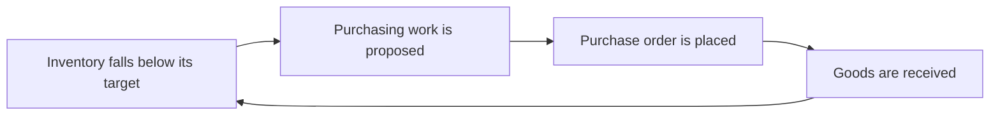
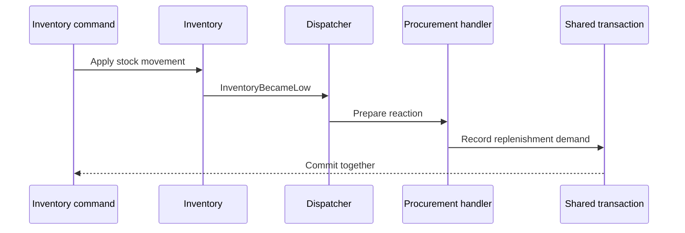
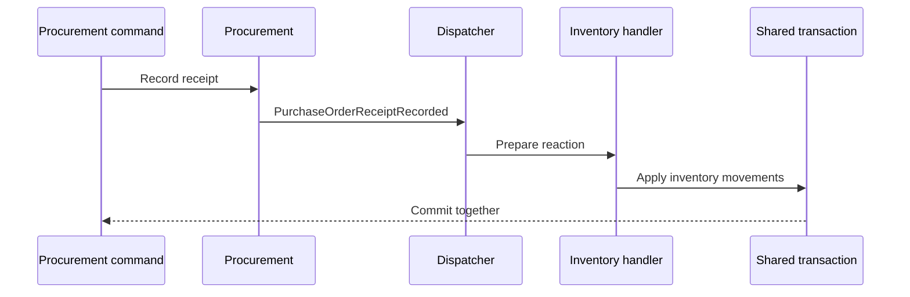
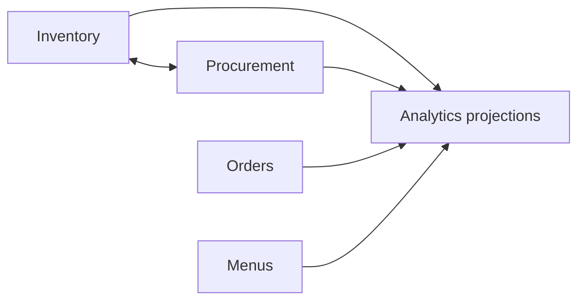



The next Mixology workshop will add Procurement as a complete vertical slice. It starts with suppliers and the ingredients they offer, grows into purchase orders and receipts, then connects Procurement to Inventory in both directions.

That reciprocal relationship is the important part. Low stock in Inventory can create purchasing work, while receiving a purchase order in Procurement can replenish Inventory. Neither domain is simply upstream of the other. Their relationship forms a cycle in the business graph even though the package dependency graph must remain controlled.

Orders and Inventory already demonstrate reciprocal consistency in the current repository: placement reserves stock, stock changes block orders, and cancellation or amendment release reconciles affected peers. `Orders.AmendBatch` owns a selected batch as one command, emitting `OrdersAmended` for Inventory, Orders, and Menus to prepare and persist their leaf reactions. `Ingredients.Retire` is a separate command with a separate commit; if retirement fails, an approved amendment batch remains committed. Procurement remains the proposed extension for work that spans time and commits, not the first example of reciprocal reactions.

This guide records the intended workshop before the feature is implemented. It gives the future implementation a sequence, a set of ownership decisions, and concrete checkpoints. It also leaves room for the code to teach us where Mixology's current transactional dispatcher is sufficient and where Procurement must retain progress across separate decisions and commits.

The workshop builds on [Turning Cross-Domain Calls into Enforced Boundaries](/articles/turning-cross-domain-calls-into-enforced-boundaries/). That guide derives one-way reactions from an ingredient deletion. This one asks what changes when two stateful domains continually affect one another.

## Begin with a business loop

Procurement closes a loop that already begins in Inventory:



The loop contains several many-to-many relationships:

- a supplier offers many ingredients;
- an ingredient may be offered by many suppliers;
- a purchase order contains many offerings;
- an offering may appear on many purchase orders over time;
- one stock condition may contribute to several purchasing decisions;
- one receipt may replenish several inventory positions.

These are not join tables wearing domain names. They carry decisions and history. An offering has a supplier SKU, purchase unit, conversion into an inventory unit, lead time, price, and availability. A purchase order moves through a lifecycle. A receipt records what actually arrived, which may differ from what was ordered.

The slice therefore turns otherwise plain records into stateful entities. Their transitions produce facts that other domains can react to, and every transition passes through the same authorization, transaction, dispatch, and audit pipeline as the rest of Mixology.

## Establish ownership before writing packages

The workshop should first write down which domain can decide each fact.

Procurement owns:

- supplier identity and lifecycle;
- the mapping between a supplier offering and an ingredient ID;
- external SKUs, purchasing units, prices, minimum quantities, and lead times;
- purchase-order creation, submission, cancellation, and receipt;
- the difference between ordered, received, rejected, and outstanding quantities.

Inventory owns:

- the quantity currently on hand;
- reservations and available quantity;
- reorder targets and the decision that stock is low;
- application of a receipt to stock;
- corrections, spoilage, and other inventory movements.

Ingredients remains the source of ingredient identity and measurement semantics. Procurement may ask Ingredients whether an ingredient exists and which units are valid. It should not mutate Ingredients or copy all ingredient behavior into an offering.

This allocation creates a useful tension. Procurement decides that goods were received, but Inventory decides how that receipt changes stock. Inventory decides that stock is low, but Procurement decides whether to open, combine, defer, or reject purchasing work. Events communicate facts across those decisions without transferring ownership.

## Build the vertical slice in visible increments

The workshop should keep every increment runnable. Each stage introduces one architectural concern and ends with a checkpoint that a learner can verify through a public application surface.

### 1. Add suppliers and offerings

The first stage introduces the Procurement module, its public models and queries, its private commands and persistence, and its composition root registration. A supplier can be created, updated, retired, and queried. Offerings connect active suppliers to ingredients with their purchasing details.

This stage should include:

- typed IDs and value objects for supplier identity, SKU, price, lead time, and unit conversion;
- state transitions that prevent adding an offering to a retired supplier;
- Cedar resources and actions for supplier and offering operations;
- audit records containing both the actor and the touched entities;
- topology and architecture tests that make the new domain obey existing package rules;
- one presentation surface first, followed by surface-specific projections as the workshop expands.

The checkpoint is intentionally ordinary: add two suppliers that offer the same ingredient, retire one, and observe that its offerings cannot be selected for new purchasing work. This establishes the complete vertical route before cross-domain behavior makes it more complicated.

### 2. Model purchase orders as stateful entities

A purchase order should not be a CRUD record with a status string. Its operations express permitted transitions:

```text
Draft -> Submitted -> PartiallyReceived -> Received
   |          |
   +----------+-> Cancelled
```

Exact transitions can change during implementation, but invalid states should be difficult to construct. A submitted order snapshots the supplier SKU, price, unit conversion, and ordered quantity used for that commercial decision. Later edits to an offering must not rewrite history.

Commands such as `AddLine`, `Submit`, `Cancel`, and `Receive` should enforce behavior rather than exposing a general update. The audit trail can then say which decision occurred and which purchase order, lines, supplier, and ingredient references were involved.

The checkpoint submits an order, changes the current offering price, then demonstrates that the submitted order retains its original terms. It also attempts an invalid transition through the public module and observes the typed application error.

### 3. Consume low-stock facts

Inventory can publish a fact when a stock transition crosses below its reorder target. Procurement handles that fact and records purchasing work, such as a demand proposal or replenishment request.



The event should report the Inventory fact, such as the ingredient, available quantity, target, and crossing time. It should not prescribe `CreatePurchaseOrder`. Procurement owns whether demand is combined with existing work, matched to an offering, or left unresolved because no supplier can fulfill it.

Idempotency matters even with in-process delivery. A stable source reference prevents repeated handling of the same low-stock transition from creating duplicate demand. A later durable delivery mechanism can then reuse the same business key.

The checkpoint reduces several inventory positions below target and queries Procurement for unresolved demand. One ingredient has competing offerings, another has none, making the distinction between observing demand and automatically choosing a supplier visible.

### 4. Publish receipt facts

Receiving an order is the return path. Procurement records what arrived and publishes a `PurchaseOrderReceiptRecorded` fact. Inventory handles the fact and applies stock movements using the receipt quantities and unit conversions captured by Procurement.



This is reciprocal collaboration without reciprocal implementation imports. Inventory publishes a fact owned by Inventory and Procurement reacts. Procurement publishes a fact owned by Procurement and Inventory reacts. Public event contracts point away from their source modules, while private commands and DAOs remain inaccessible across the boundary.

The checkpoint receives only part of an order. The purchase order becomes partially received, inventory increases by the actual accepted quantity, the outstanding quantity remains explicit, and the audit view connects the originating receipt with the inventory movements created in the same operation.

## Make consistency observable

The workshop should prove more than successful examples. Reciprocal behavior is valuable because it exposes consistency choices that CRUD demonstrations rarely reach.

The test path should include:

- successful low-stock handling and receipt handling through public modules;
- rollback of the originating command and every handler mutation when one reaction fails;
- duplicate event handling using the same source reference;
- partial receipts and over-receipt rejection;
- supplier retirement while a submitted order remains open;
- an ingredient unit change that makes a draft offering require review without rewriting submitted orders;
- concurrent attempts to receive the same outstanding quantity;
- audit assertions that connect source decisions and cross-domain consequences.

A cross-domain integration test can create ingredients, stock, suppliers, offerings, and an order, then follow the loop from depletion to replenishment. Focused state-machine tests protect entity transitions. Architecture tests protect import direction. Dispatcher tests protect preparation, handling, and rollback. Together they show that business cycles do not require dependency cycles.

## Stop handlers from becoming hidden workflows

Mixology's handler context cannot add events, and middleware rejects commands invoked from commands, queries, or handlers, including reconstructed contexts. A SQL transaction can be claimed by only one command, so sequential commands cannot share a caller-owned transaction either. A handler is a leaf reaction inside its originating command's transaction. Those constraints keep dispatch finite and make rollback understandable.

The low-stock path immediately tests this rule. A tempting handler might do all of the following:

```text
InventoryBecameLow
  -> create a purchase order
  -> submit the purchase order
  -> announce PurchaseOrderSubmitted
  -> notify another domain
```

The current dispatcher deliberately prevents that chain. The first implementation should respect the constraint. The Procurement handler can record replenishment demand as a leaf mutation. A later Procurement command can turn selected demand into a draft purchase order. Submission can be another command and commit, or a single domain-owned command can express the business decision to create and submit together. It must persist its own state and publish facts for leaf reactions rather than call those two commands from a callback loop.

That separation is useful teaching material. An event reaction and a business workflow answer different questions:

- A transactional handler applies an immediate consequence that must commit or roll back with its source operation.
- A domain-owned command carries one explicit decision through its own writes, leaf reactions, and audit activity in one transaction.
- Durable domain state records progress between decisions, such as an approved purchase awaiting receipt, without holding a transaction open.

The workshop should not remove the no-cascading rule merely to make the example flow automatically. It should let the friction identify the point where a new abstraction earns its place.

## Preserve progress between domain decisions

Purchasing spans time. An approved purchase may wait for a supplier, receive only part of its quantity, and remain open until the rest arrives. Procurement should preserve that progress in its own models rather than widening a transaction across the entire business loop.

Its persisted state might record:

- replenishment demand already incorporated;
- selected offerings and the policy that selected them;
- approval state and agreed quantities;
- purchase-order and receipt identities;
- received and outstanding quantities;
- deadlines and unresolved exceptions.

Approval now and receipt later are separate explicit Procurement commands. Each validates its own transition, publishes facts, and commits its leaf reactions with one audit activity. A rejected receipt leaves the earlier approval intact. Inventory applies the stock consequence of a receipt as a leaf reaction; Procurement does not invoke an Inventory command.

The workshop should test those durable states and failure boundaries directly. A future process manager or saga would require a separate business requirement and design review. It is not part of this planned slice or a replacement for consuming-domain command ownership.

## Add an outbox when the transaction boundary changes

The initial Procurement and Inventory reactions can remain synchronous because both domains share a database and require immediate consistency. A recorded receipt and its inventory movement either commit together or roll back together.

An outbox becomes warranted when a fact must survive beyond that transaction, especially when integrating with a supplier API, email system, data warehouse, or separately operated service. The originating command writes the business change and an outbox record atomically. Delivery occurs after commit and may retry, so consumers must be idempotent.

That creates two deliberately different event roles:

```text
transactional domain event
  -> immediate, in-process reactions
  -> one rollback boundary

outbox integration message
  -> post-commit delivery
  -> retries and idempotent consumers
  -> eventual consistency
```

The future workshop should introduce the outbox only if it follows one of those post-commit requirements. Using it for the initial receipt path would obscure the simpler guarantee the modular monolith already provides.

## Keep Analytics beside the slice, not inside it

Procurement data naturally invites an Analytics domain: supplier lead-time trends, price movement, fill rates, stockout frequency, purchasing spend, and the time from low-stock detection to replenishment.

Analytics should be considered as a later projection and read-model consumer, not another owner in the Procurement transaction. It does not decide whether a purchase order may be submitted or how a receipt changes stock. It observes facts owned by Procurement, Inventory, Orders, Menus, and Ingredients, then builds query shapes designed for trends and aggregates.

This is a different collaboration pattern from the reciprocal operational loop:



Analytics can begin as rebuildable projections in the same application. If reporting work later needs independent storage or asynchronous ingestion, the outbox boundary provides a natural source. Keeping it separate prevents reporting concerns from widening operational transactions and gives a future workshop a clean example of one-way, eventually consistent consumption alongside the reciprocal, immediately consistent Procurement loop.

## Define completion as a learning path

The completed workshop should leave a learner with more than a new menu entry. It should demonstrate this sequence:

1. Add a domain through every application layer.
2. Replace record updates with explicit entity transitions.
3. Assign cross-domain facts to the domain that can truthfully announce them.
4. React in the interested domain without importing its collaborator's private implementation.
5. Give one domain command and its leaf reactions a shared transaction when consequences require immediate consistency.
6. Preserve history through snapshots and audit records.
7. Recognize when a leaf handler is being asked to become a workflow.
8. Preserve progress in domain-owned state across commits; introduce an outbox when external delivery requires it.

Procurement is useful because it begins as a familiar vertical slice and ends by challenging the architecture. Its reciprocal relationship with Inventory makes the dispatcher and audit pipeline visible, while command ownership and the no-cascading constraint keep every transactional consequence explicit. The result should be both a working feature and a guided way to reason about consistency in a modular monolith.
