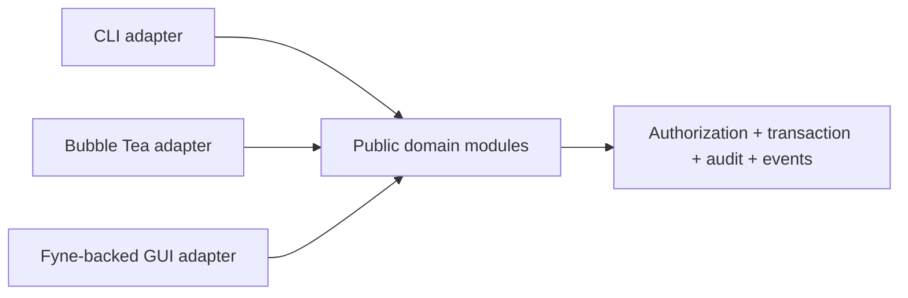

Mixology presents one application through a command-line interface, a persistent Bubble Tea terminal interface, and a native [Fyne](https://fyne.io/) desktop interface written in Go. The desktop experiment pursued the union of existing application behavior on macOS, Windows, and Linux. The more useful result is what happened to the architecture when a third, substantially different presentation model had to use it.

This guide is a development journal. It began before the desktop code existed, so the early sections preserve the questions and acceptance criteria that guided the work. Later sections record the reviewed commits, tests, running behavior, and closure audit that resolved them.

<div class="notice--series" markdown="1">
**Experiment status:** the closure audit now supports code-level functional parity across the CLI, Bubble Tea TUI, and Fyne-backed GUI surface. The desktop composition can mount all seven domain-owned surfaces plus the dashboard, exposes only those readable by the active persona, owns async shutdown, presents typed errors consistently, exposes guarded keyboard commands, and has composed acceptance and fresh-process cross-surface tests. Manual assistive-technology audits and production signing remain release responsibilities rather than completed claims.
</div>

The experiment builds directly on [Mixology's existing TUI architecture](/guides/building-an-application-tui-toolkit/). That surface adapts ideas from CODE Framework's shell, standard-view, and MVVM patterns to Bubble Tea's message loop. Fyne gave those ideas a different test. A retained widget tree has callbacks, bindings, focus, dialogs, and a UI thread rather than `Init`, `Update`, `View`, and `tea.Cmd`. The opening hypothesis was that a real application boundary would let the desktop surface adopt Fyne's native shape without copying business behavior or turning the TUI into a framework-neutral compromise. The completed implementation supports that hypothesis.

## The starting seam

The existing package layout already says that a surface belongs to a domain and a concrete presentation technology:

```text
app/domains/drinks/surfaces/
    cli/
    tui/
```

The GUI work extends that vocabulary:

```text
app/domains/drinks/surfaces/
    cli/
    tui/
    gui/
```

The initial design did not expect that third directory to reuse Bubble Tea view models. The TUI models correctly owned terminal widgets, typed messages, keyboard behavior, text rendering, and terminal sizing. The working criterion was that a GUI surface should be equally specific to its runtime, owning widgets, callbacks, observable presentation state, selection, validation, dialog lifecycle, and UI-thread coordination. The resulting GUI surfaces follow that division.

The shared seam sits behind all three adapters. Each operation enters an exported domain module through an application session and therefore follows the same transaction, authorization, audit, and event pipeline. The desktop client preserves the persistent-session model already used by the TUI, including a fresh middleware context for every operation.



At this first checkpoint, the composition root constructed an `app.Session`, and the desktop lifecycle test observed the database being created and released cleanly. The rest of the diagram remained a hypothesis pending domain workflows and cross-surface tests. The completed slices, architecture rules, and cross-surface tests described below supplied that evidence without requiring a GUI surface to import a DAO, a private command, or another presentation surface.

## The first foundation

The first implementation slice chose [Fyne 2.8.0](https://github.com/TheFellow/go-modular-monolith/blob/5af00d09571e03a21665774258f8f3d32b111d16/go.mod) and added a dedicated desktop executable. The [application-facing rename](https://github.com/TheFellow/go-modular-monolith/pull/34) exposed that entry point at `main/gui`, while the reusable framework mechanics initially lived in `pkg/fyne`. The current package is [`pkg/toolkits/gui`](https://github.com/TheFellow/go-modular-monolith/tree/main/pkg/toolkits/gui): GUI names its architectural purpose, while Fyne remains its implementation technology. Its composition root opens the shared `data/mixology.db` database used by the CLI and TUI, places the diagnostic log in the platform's per-user configuration directory, constructs the application and persistent session, and installs an idempotent close path on the native window. The test uses Fyne's in-memory application and virtual window, navigates the composed shell, closes it twice, and then reopens the same database to prove that ownership was released.

The reusable [`pkg/fyne` foundation](https://github.com/TheFellow/go-modular-monolith/tree/5af00d09571e03a21665774258f8f3d32b111d16/pkg/fyne) contains only desktop mechanics. Its shell validates routes, builds views lazily, preserves them after navigation, and changes the active title and content. A later [presentation-mechanics slice](https://github.com/TheFellow/go-modular-monolith/commit/5af00d09571e03a21665774258f8f3d32b111d16) added latest-request state, submission ownership, validation, semantic controls, test executors, dialog fakes, and a headless widget driver. Review then found that a panic could leave a submission permanently active; [the correction](https://github.com/TheFellow/go-modular-monolith/commit/5af00d09571e03a21665774258f8f3d32b111d16) releases ownership before propagating the panic.

Async publication has an equally small seam. `MainDispatcher` delegates to `fyne.Do`, while `InlineDispatcher` publishes synchronously for deterministic tests. Domain presenters now combine that dispatch boundary with latest-request generations and active-submission guards. Their tests queue work, deliver results out of order, and assert that stale work cannot replace current state or enable a second mutation.

The tests run without a display server through `fyne.io/fyne/v2/test`. CI installs the Linux OpenGL, Wayland, keyboard, and X11 development dependencies needed to compile Fyne, then includes the desktop packages in the race-enabled test run. Composed acceptance tests navigate every owner-visible workspace, verify restricted-persona route visibility, observe one application session, exercise restricted mutations in readable workspaces, and verify shutdown with real domain work in flight.

## Adapt MVVM to the runtime

CODE Framework is useful here because its lessons are larger than one binding engine. An application shell should own application-wide experience. Repeated business layouts deserve consistent conventions. View models should expose presentation state and actions that can be tested separately from the pixels. Domain-specific screens should retain their own vocabulary and workflows.

Fyne should change how those lessons are expressed. The desktop shell can own the window, navigation, menus, status, theme, and lifecycle. Domain presentation models can own typed selection, loading and error state, editable values, action availability, and calls to the public application API. Views can construct Fyne containers and widgets, bind callbacks, and translate presentation state onto the UI thread.

This does not require a universal view-model interface shared with Bubble Tea. Such an interface would either expose the least useful common denominator or conceal each runtime behind another framework. The intended reuse is narrower and more durable:

- Application behavior remains in public domain modules.
- Transport-neutral models, IDs, filters, tags, and typed errors remain shared.
- Fyne mechanics proven across several screens live in the dedicated `pkg/toolkits/gui` toolkit.
- Application-wide Fyne components may live at the desktop composition edge.
- Domain actions and presentation state remain in each domain's GUI surface.

The resulting desktop now has one toolkit-owned shell and a small family of standard pages. Its persistent left navigation keeps the active actor and role visible, selects the dashboard or an authorized domain workspace, and marks the active route. List workspaces place filters and primary actions above a table and contextual detail pane. Create and edit workflows use a scrolling form with consistent status, Save, and Cancel placement. Domain packages supply the state, content, and commands, while `pkg/toolkits/gui` owns the shell, list/detail proportions, action hierarchy, empty states, and form layout.

Those abstractions were earned across all seven domain surfaces. They make CODE Framework's standard-view lesson concrete without turning the toolkit into a domain-aware screen generator.

## A second pass made the desktop legible

Functional parity established that every workflow existed, but it did not make every workspace equally easy to scan. The next GUI pass reshaped the seven domain surfaces around one visual language while preserving their domain-specific actions. Drinks, Ingredients, Inventory, Menus, Orders, and Audit now use aligned table rows with native headers. Headers resize columns and, where the domain supports ordering, sort the current result. Tag columns render compact pills, horizontal scrolling preserves values when their natural width exceeds the viewport, and the list and detail remain independently scrollable within the split workspace.

Selection opens a read-oriented detail rather than an editing form. Authorized row actions offer the operations available for that entity, while the detail action bar keeps lifecycle transitions near the state they affect. Drinks expose recipe editing, Ingredients expose dependency-aware deletion, Inventory separates receive, consume, adjust, set, and tag operations, Menus keep drink curation and publish or draft transitions with the menu, and Orders place completion, cancellation, and tagging beside the order detail. Audit remains read-only. The Tags workspace uses a catalog and usage summary before entering entity inspection or complete-set editing.

Forms also moved away from transport-shaped input. Tag fields are token editors: Enter validates and inserts a `key` or `key=value` token, an existing key is replaced, and individual pills can be removed. Drink recipe rows use named ingredient selectors, substitute pills, and compact add or remove actions instead of exposing identifiers or dense nested forms. Field labels sit above full-width controls, wheel events continue scrolling the containing detail page even over text fields, and explicit empty-collection views distinguish a successful query with no rows from a loading or error state.

The shared toolkit now carries the mechanics behind that consistency: semantic buttons and entries, guarded action selectors, reusable table cells, icons, sortable native headers, row action menus, full-width detail fields, empty states, and token layouts. Domain presenters still decide which actions are authorized and meaningful. Headless tests recycle table cells across text, tags, and actions, exercise sorting and resizing, reject recursive or stale action callbacks, preserve form scrolling, and drive the token editor through canonical tag normalization.

The pass also tightened Fyne's concurrency contract. Production publication and startup work enter the UI through `fyne.Do` or `fyne.DoAndWait`, while tests retain deterministic dispatch. Visual acceptance cases use fixed window sizes and Fyne's in-memory driver to cover the dashboard, tables, detail states, forms, menus, tags, audit, and empty collections. This makes layout and thread ownership tested presentation behavior rather than assumptions left to a manual launch.

## Make testability part of the design

The existing TUI could be driven below a real Bubble Tea program, and its domain view models could be exercised with production application fixtures. Before feature work began, the desktop plan required an equivalent testing ladder so callbacks would remain testable.

That plan established four layers of evidence:

1. Presentation-model tests exercise state transitions, validation, action availability, stale-result handling, and typed errors without requiring a visible desktop.
2. Reusable Fyne component tests construct widgets through Fyne's test facilities and drive taps, text entry, selection, dialogs, and binding changes.
3. Shell tests cover navigation, view lifetime, refresh policy, window-level actions, and lifecycle behavior through the composed desktop application.
4. Cross-surface tests mutate persisted state through one adapter and observe it through another, proving that CLI, TUI, and GUI are paths into the same application rather than parallel implementations.

The test harness was an early deliverable. It supports deterministic execution without a display server, exposes useful helpers without hiding Fyne behavior, and makes UI-thread boundaries explicit. Race tests matter because desktop callbacks and background application work introduce concurrency that a synchronous component test can otherwise miss.

Feature parity also required a written matrix. Its source was the union of existing CLI and TUI behavior, not only the set of TUI screens at the time. The matrix treated a screen as complete only when its evidence covered loading, empty state, filtering, selection, validation, create and edit flows, destructive confirmation, domain-specific actions, tags, authorization failures, other typed errors, refresh after mutation, and keyboard behavior where the desktop exposed it. In particular, parity included menu drink curation and order placement even though those operations were distributed differently between the two existing adapters.

## Seven slices, one retained-mode lesson

The accepted vertical slices now cover [Drinks](https://github.com/TheFellow/go-modular-monolith/commit/6d9ec7830b600019e8c2d878d6d04ef304e34c58), [Ingredients](https://github.com/TheFellow/go-modular-monolith/commit/2499ea57230d15d5905ea0696911b56acd269232), [Inventory](https://github.com/TheFellow/go-modular-monolith/commit/678fc63a7fb49c3fba0b1a1ef6c3c5b9b843d43f), [Menus](https://github.com/TheFellow/go-modular-monolith/commit/78b3dda9bedb6fbbe463c43355af1cb0e5d5e484), [Orders](https://github.com/TheFellow/go-modular-monolith/commit/81efd61daf01d84f4891e8a9417935e5e1480b37), [Audit](https://github.com/TheFellow/go-modular-monolith/commit/92e5ff4ab967d20456733a82dacd6855c0145473), and [Tags](https://github.com/TheFellow/go-modular-monolith/commit/bed70833e5fbfefd8fd910c9adb1054790a62c6f). The [dashboard slice](https://github.com/TheFellow/go-modular-monolith/commit/d0fcaaafeb91b58fbec96e7cf11281c46ad6673d) is already composed into the shell and has a synchronized close test. Each domain package owns a presenter with typed state and a Fyne view with concrete widgets. The presenters call public modules through `app.Session`; the views translate snapshots into framework-native controls.

Review repeatedly found problems that a happy-path screenshot would not reveal:

- **Paging is part of correctness.** Desktop lists often want a complete catalog for selectors or local navigation, while domain APIs remain paged. Drinks and Menus now traverse every page, Ingredients counts drink usage across pages before deletion, and Orders tests forward and backward cursors. Audit preserves the public query's default limit rather than normalizing it into a different request.
- **A retained widget can be newer than its presenter snapshot.** An ingredient catalog refresh or unrelated publication must not overwrite text a person is currently editing. Views now track the form state they last rendered and update controls only when the presenter changes that form. Busy states disable every mutable control, not only the Save button.
- **Reopening the same workflow is still a new form.** Comparing only mode and values cannot distinguish a cancelled form from a fresh form containing equal values. Drinks increments a form-instance generation so reopening Create clears dirty selectors and reopening Edit restores persisted values.
- **Selectors should carry structure, not ask people to type IDs.** Drink recipes use named ingredient and substitute choices, Menu curation uses drink choices, Inventory holds a selected stock item, and Order placement builds typed menu and drink selections. The presenter retains IDs; the view presents domain names and constrained options.
- **The mutation target must not drift.** Delete confirmations capture the selected entity before asynchronous dependency checks. Inventory locks selection while an edit is active. Tag results retain both the target identity and display name even if the catalog or current selection changes before publication.
- **Authorization failures still need a usable form.** A denied mutation rolls back through the ordinary application pipeline, but the presenter preserves correctable input and presents the typed permission error. Orders also tolerates a permission denial while enriching a selected row, retaining enough public list state to enter a tag workflow without inventing a private read path.

These are CODE-style MVVM lessons expressed through Fyne rather than XAML. The presenter owns durable interaction meaning; the view owns live controls; an instance or request generation states which publication may update which interaction. The separation becomes useful only when tests can race those boundaries deliberately.

## Cross-surface evidence must cross a process

Calling a public module and then reading it through a presenter proves a shared application contract, but it does not prove that a CLI adapter parses arguments, opens the expected database, commits, and exits successfully. The Drinks, Menus, and Orders suites now build the real `main/cli` binary, invoke it as a subprocess against a temporary database, and then open that database through a GUI session. They also write through the GUI and inspect the persisted result through the application API.

That is stronger evidence than sharing an in-memory fixture. It caught the distinction between the TUI's visible workspaces and the CLI's additional workflows. The desktop parity target is therefore the union: Drinks includes structured recipes, Menus includes drink curation and cost analysis, and Orders includes placement as well as completion and cancellation.

The [fresh-lifecycle cross-surface test](https://github.com/TheFellow/go-modular-monolith/commit/5f71a3151fe733a1ca1fc8045450d7e2a4f0d4bf) closes the remaining composed gap for Ingredients, Inventory, Audit, and Tags. It builds and runs the real CLI, opens a new desktop process lifecycle on the same database, observes CLI writes through concrete GUI views, closes the desktop, and then observes a GUI tag mutation through a fresh CLI invocation. Together with the Drinks, Menus, Orders, and existing CLI-to-TUI tests, this demonstrates the shared persistence contract across all three adapters without importing one presentation package into another.

## The third surface audited the first two

The first parity matrix treated the CLI and TUI as the reference set. Detailed comparison showed that the set itself had drifted. The desktop work therefore became an audit of all three adapters rather than a one-way port.

- The GUI ingredient editor initially loaded only the first selector page. The [paging correction](https://github.com/TheFellow/go-modular-monolith/commit/2499ea57230d15d5905ea0696911b56acd269232) traverses the complete ingredient catalog and tests a target beyond the first page.
- The TUI had no complete counterparts for Menu drink curation and analysis, Order placement, or full Drink recipe editing. The [Menu](https://github.com/TheFellow/go-modular-monolith/commit/78b3dda9bedb6fbbe463c43355af1cb0e5d5e484), [Order](https://github.com/TheFellow/go-modular-monolith/commit/81efd61daf01d84f4891e8a9417935e5e1480b37), and [recipe](https://github.com/TheFellow/go-modular-monolith/commit/6d9ec7830b600019e8c2d878d6d04ef304e34c58) slices added framework-native workflows, then event-loop tests hardened focus, scrolling, free-form notes, confirmation, and async ownership.
- List behavior was not consistent merely because every surface displayed a list. Drinks, Ingredients, Inventory, Menus, Orders, and Audit gained cursor-aware TUI navigation that preserves server-side filters, query context, and selection. Audit additionally exposes actor, action, entity, and time scopes rather than reducing its public query to text search.
- Inventory exposed several shared-semantic leaks. The correction series centralized the low-stock threshold used by filters and dashboard counts, reused one user-facing currency parser, aligned adjust and set inputs, and added cross-surface tests for quantity, cost, tags, authorization, and rollback.
- The CLI Menu adapter lacked lifecycle operations that the application already supported, and its JSON representation could lose item prices. Order placement could discard top-level or item notes, and status-oriented workflows needed structural assertions rather than output-string guesses. The CLI corrections added create, update, drink curation, publish, draft, analysis, delete, note preservation, and structured audit-action decoding.

The dashboard revealed the architectural version of the same problem. GUI and TUI code had independently assembled counts, low-stock semantics, partial failures, and recent audit activity. The [shared dashboard aggregate](https://github.com/TheFellow/go-modular-monolith/commit/d0fcaaafeb91b58fbec96e7cf11281c46ad6673d) moved that read model into `app`, with each persistent surface adapting the same result instead of maintaining parallel business-shaped queries. The aggregate treats a denied count or recent-activity query as unavailable rather than failing the whole dashboard, while operational failures still surface as errors.

Tags exposed a mutation boundary. A form can save domain state and a complete tag set, but two sequential commands can leave the first committed when the second fails. [`RunTaggedMutation`](https://github.com/TheFellow/go-modular-monolith/commit/c565fd6e95c5db781eaefb110c04944cf3188830) validates tags first and executes the domain mutation plus tag replacement in one store transaction. TUI and GUI code still parse, validate, render, and coordinate their forms independently; they share only the atomic application operation.

That service is protected at two levels. Behavioral tests force tag replacement failure and assert that the domain change and audit entry roll back. AST-based [TUI wiring](https://github.com/TheFellow/go-modular-monolith/commit/5f71a3151fe733a1ca1fc8045450d7e2a4f0d4bf) and [GUI wiring](https://github.com/TheFellow/go-modular-monolith/commit/5f71a3151fe733a1ca1fc8045450d7e2a4f0d4bf) contracts enumerate all fifteen tagged mutation paths so a future presenter cannot quietly bypass the atomic composition. This is deliberately narrow static analysis for a property too important to leave to code-review memory.

The next audit pass tightened fidelity that broad workflow tests had not yet made visible:

- [Desktop actor selection](https://github.com/TheFellow/go-modular-monolith/commit/da9b52db6197917088088856384dfa1c6b356026) now accepts the same owner, manager, sommelier, bartender, and anonymous personas as the CLI and TUI through `-actor` and `-as`. Startup parsing rejects unknown actors before opening the application, and the shell keeps the active actor and role visible across routes.
- Desktop composition probes each workspace's authorized read path and omits denied routes from navigation and dashboard cards. This hides Audit and Tags from a sommelier, for example, while Cedar still filters individual rows inside readable workspaces such as Drinks. Non-permission failures leave the route visible so the workspace can report the actual problem.
- The GUI originally hid paging inside full-catalog loads or defaults. [Drinks](https://github.com/TheFellow/go-modular-monolith/commit/6d9ec7830b600019e8c2d878d6d04ef304e34c58), [Ingredients](https://github.com/TheFellow/go-modular-monolith/commit/2499ea57230d15d5905ea0696911b56acd269232), and [Menus](https://github.com/TheFellow/go-modular-monolith/commit/78b3dda9bedb6fbbe463c43355af1cb0e5d5e484) now expose explicit page size, Next, and Previous controls backed by domain cursors, history, server filters, and invalid-limit feedback. Tests create more than one hundred records so the controls cannot pass while still showing only the first page.
- [Order item notes](https://github.com/TheFellow/go-modular-monolith/commit/81efd61daf01d84f4891e8a9417935e5e1480b37) are now multiline in the GUI placement form, preserving commas and newlines through persistence. This complements the earlier CLI and TUI note corrections and treats free-form item instructions as data rather than a single-line widget convenience.
- [Inventory detail and Set semantics](https://github.com/TheFellow/go-modular-monolith/commit/678fc63a7fb49c3fba0b1a1ef6c3c5b9b843d43f) now agree across CLI, TUI, and GUI. Detail views expose the exact RFC 3339 `LastUpdated` value. A blank Set cost preserves an existing price, defaults a new item to USD zero, and accepts an explicit currency change such as EUR through the shared price parser.
- [Menu detail metadata](https://github.com/TheFellow/go-modular-monolith/commit/78b3dda9bedb6fbbe463c43355af1cb0e5d5e484) now includes creation and optional publication timestamps plus each item's drink identity, sort order, and availability in both TUI and GUI. Items render in defined order, so the same data is not silently reduced by one visual adapter.

[Atomic composition received a review of its own](https://github.com/TheFellow/go-modular-monolith/commit/c565fd6e95c5db781eaefb110c04944cf3188830). `RunTaggedMutation` now detects a caller-owned transaction and participates in it rather than attempting to open and commit a nested unit of work. A rollback test proves that both the domain mutation and tags disappear when the outer workflow rolls back. The wiring contracts were strengthened to inspect the mutation callbacks as well as the presence of the helper, preventing a superficial call from satisfying the test while the real write remains outside the atomic boundary. Tagged confirmation tests also prove that tag choice advances into the domain confirmation rather than skipping a destructive workflow step.

The last closure discrepancy was GUI Audit page-size validation. The [fix](https://github.com/TheFellow/go-modular-monolith/commit/92e5ff4ab967d20456733a82dacd6855c0145473) rejects zero, negative, and nonnumeric sizes without changing the retained query, rows, cursor history, or selection, while preserving an intentionally empty inverted time interval as a valid query. The [acceptance correction](https://github.com/TheFellow/go-modular-monolith/commit/5f71a3151fe733a1ca1fc8045450d7e2a4f0d4bf) then aligned tests with explicit paging metadata and repaired a Menu detail fixture so it satisfies the real recipe invariant rather than depending on test order.

With those corrections, the audited matrix supports code-level functional parity. The lesson is stronger than “three surfaces now look alike.” A third adapter supplied enough independent pressure to identify behavior that belonged in the application, behavior that belonged in each concrete view, and accidental differences that belonged nowhere.

## Enforce the new boundary

Go's `internal` visibility does not prevent a same-domain desktop package from importing its domain's private implementation. Mixology closes that gap for every surface with arch-lint.

The intended constraints include:

- `app/domains/*/surfaces/gui/**` uses public domain APIs and cannot import `app/domains/*/internal/**`.
- A reusable presentation toolkit cannot import `app/**` or `main/**`.
- GUI surfaces cannot import TUI or CLI surface packages.
- TUI and CLI surfaces cannot import GUI surface packages.
- The desktop composition root may compose domain GUI surfaces, while domains remain unable to import that root.

The foundation added concrete rules for the reusable toolkit, same-domain internal access, TUI reuse, application-root access, and cross-domain surface imports. Independent review first found that a GUI surface could still import its sibling CLI adapter. The follow-up closed that path and changed the architectural statement from “TUI and GUI” to “CLI, TUI, and GUI.”

The final [negative-fixture test](https://github.com/TheFellow/go-modular-monolith/commit/5f71a3151fe733a1ca1fc8045450d7e2a4f0d4bf) creates an isolated temporary module containing every representative forbidden import plus one valid public-domain import, runs arch-lint as a library, and asserts the exact violations. Building that adversarial fixture exposed a deeper problem: the cross-domain GUI rule's capture pattern was inert, so its intended violation never matched. The commit corrected the pattern and proved that toolkit-to-application, same-domain-internal, CLI, TUI, `main`, and cross-domain surface imports all fail while the public module import remains allowed.

A final [bidirectional rule update](https://github.com/TheFellow/go-modular-monolith/commit/5f71a3151fe733a1ca1fc8045450d7e2a4f0d4bf) initially brought the architecture to fourteen rules. Separate TUI and CLI rules prevented each adapter from importing the other concrete implementations. The fixture covered same-domain and cross-domain imports while continuing to allow each adapter to call its public domain module. Presentation isolation became a property of all three surfaces, not merely a restriction placed on the newest one.

A later [capture-based consolidation](https://github.com/TheFellow/go-modular-monolith/pull/35) expresses that policy without enumerating surface kinds. One rule captures the imported domain and surface, then exempts only an importer with the same captured pair. Another rule treats access to domain internals as an allowlist: the domain facade, queries, handlers, and internal implementation packages are the only consumers. Surfaces, models, events, authz, arbitrary future layers, and other domains are denied by default.

The same pull request now groups reusable mechanics below `pkg/toolkits/cli`, `pkg/toolkits/gui`, and `pkg/toolkits/tui`. The CLI toolkit contains reusable JSON input and output plus table rendering; the GUI toolkit is named for its architectural role while retaining Fyne as its implementation; and the TUI toolkit contains Bubble Tea presentation mechanics. Two captured rules make that structure symmetric. Toolkits cannot import their siblings, and each domain surface can import only the toolkit whose name matches its own surface kind. The negative fixture proves allowed consumers plus representative denied descendants. This is why an architecture rule needs a test that deliberately breaks it; a clean production graph cannot distinguish a working constraint from one that never runs.

A later architecture pass makes every `main/**` package a presentation leaf from the perspective of domain surfaces. Reusable TUI contracts, components, styles, and keys live in `pkg/toolkits/tui`, while `main/tui/routes` owns Mixology navigation identity and the root shell owns workspace composition. Domain-aware adapters remain under `app/domains/*/surfaces/tui`; there is no shared application-level TUI tree. The same pass keeps cross-domain authorization packages private and prevents command implementations from importing another domain's events, while retaining public models, queries, and events as collaboration contracts. Twelve arch-lint rules enforce the dependency graph, and architecture tests separately validate each domain's recognized package topology and its composition in `app.New`.

## Building parity in reviewable slices

The implementation progressed as a sequence of complete, commit-sized arguments:

1. Add Fyne, the desktop composition root, deterministic test harness, and executable architecture rules.
2. Establish the shell, application session, navigation, lifecycle, theme, loading, and error conventions.
3. Implement one domain vertically, including its mutations, tags, component tests, presentation-model tests, shell integration, and cross-surface evidence.
4. Extract only the Fyne mechanics supported by that implementation and the next consumer.
5. Move the remaining domain workspaces across one at a time, preserving each domain's distinct workflows.
6. Complete parity checks, race tests, architecture lint, packaging, and operating-system build verification.

Each slice was reviewed both as working software and as a teaching example. The commit history records where a reusable convention came from, why a boundary rule exists, and which test would fail if the design regressed.

## Closing the integration gap

The final commits closed the four blockers the vertical slices had exposed:

1. **Composition and normalization:** [concrete workspace composition](https://github.com/TheFellow/go-modular-monolith/commit/da9b52db6197917088088856384dfa1c6b356026) replaced every placeholder with its domain presenter and view. A shared activation contract refreshes views on entry, while domain tests preserve intentional differences such as Audit's default query limit and finite Menu margins.
2. **Lifecycle:** a [managed executor and gated dispatcher](https://github.com/TheFellow/go-modular-monolith/commit/da9b52db6197917088088856384dfa1c6b356026) stop new work, drain accepted operations, and reject queued publication before the application closes its store. Review found an ordering race between dashboard accounting and executor admission; the [shutdown correction](https://github.com/TheFellow/go-modular-monolith/commit/da9b52db6197917088088856384dfa1c6b356026) closes the dashboard first and tests real domain loads and mutations during shutdown.
3. **Errors and commands:** [typed error presentation](https://github.com/TheFellow/go-modular-monolith/commit/5af00d09571e03a21665774258f8f3d32b111d16) maps safe application error messages to inline, warning, or error treatment while retaining the cause for `errors.Is` and `errors.As`. Review corrected validation so editable input remains inline rather than opening a dialog. Guarded Refresh, New, Save, and Cancel commands invoke the same enabled controls as pointer input.
4. **Native delivery:** versioned Fyne metadata and icons feed a target-native CI matrix. Linux, macOS, and Windows jobs build, run headless surface tests, package, and upload unsigned artifacts. A review fix archives the macOS bundle before upload so executable modes survive artifact transport.

[Native keyboard navigation](https://github.com/TheFellow/go-modular-monolith/commit/da9b52db6197917088088856384dfa1c6b356026) adds platform-primary shortcuts, Escape, and Alt-number workspace navigation through Fyne menus and the same guarded commands used by buttons. The repository also records a manual accessibility protocol for focus, screen readers, high contrast, scaling, and platform conventions. Automated widget tests support keyboard operability, but they do not establish VoiceOver, Narrator, Orca, or WCAG conformance.

Delivery has a similar honest boundary. CI artifacts are deliberately unsigned. Public macOS distribution still requires Developer ID signing, hardened runtime, notarization, and stapling; Windows requires Authenticode signing. Those identity-backed release steps cannot be demonstrated by pull-request automation without protected credentials and release policy.

## Evidence ledger

The following checklist served as the evidence ledger during implementation. Completed claims link to the commit, code, or test that supports them, while unchecked items preserve the release work that remains outside the experiment's code-level closure.

### Architecture

- [x] Desktop entry point and composition root are explicit.
- [x] Every domain has a bespoke `surfaces/gui` adapter.
- [x] Domain desktop operations use `app.Session` and obtain fresh operation contexts.
- [x] GUI surfaces use public modules and do not import domain internals or another presentation surface.
- [x] The initial shared Fyne package contains shell and dispatch mechanics rather than domain policy.
- [x] Twelve arch-lint rules enforce captured surface isolation, leaf-only composition, matching toolkit access, toolkit independence, cross-domain ownership, and explicit internal consumers; isolated negative fixtures prove representative allowed and denied imports.

### MVVM and desktop behavior

- [x] The shell and composition root own application-wide navigation, activation, status, and shutdown lifecycle.
- [x] Domain presentation state is tested without opening a native window.
- [x] Views own Fyne widget construction and event wiring.
- [x] Domain async results return through an injected dispatcher, with production using Fyne's UI goroutine.
- [x] Async loads and submissions have request, target, and form-instance ownership semantics.
- [x] Repeated desktop mechanics, including the shell, list/detail pages, sortable and resizable tables, form pages, action hierarchy, token editors, and explicit empty states, have shared, headless-tested implementations in `pkg/toolkits/gui` and `pkg/testutil/fynetest`.

### Feature parity

- [x] Dashboard and global navigation compose every workspace readable by the active persona and omit denied routes and cards.
- [x] The Drinks package supports browse, filter, detail, structured create and edit, delete, and tags.
- [x] The Ingredients package supports browse, filter, detail, create, edit, dependency-aware delete, and tags.
- [x] The Inventory package supports browse, filter, detail, receive, consume, adjust, set, and tags.
- [x] The Menus package supports browse, filter, detail, create, edit, drink curation, publishing, drafting, cost analysis, delete, and tags.
- [x] The Orders package supports browse, filter, detail, placement, completion, cancellation, and tags.
- [x] The Tags package supports discovery, summaries, entity inspection, and complete-set editing.
- [x] The Audit package supports paged browse, filters that preserve public query semantics, and detail.
- [x] Domain packages present validation, empty states, authorization failures, and other typed errors.

### Verification

- [x] The final audited CLI, TUI, and GUI behavior matrix passes without unexplained code-level discrepancies.
- [x] Presentation-model, reusable-component, and composed acceptance tests cover the desktop workflows.
- [x] Headless shell tests drive navigation and lifecycle through the composed desktop client.
- [x] Fresh-process cross-surface tests cover the CLI and GUI persistence contract, alongside existing CLI and TUI tests.
- [x] Race-enabled Fyne tests, native macOS build, and arch-lint pass locally at guide closure.
- [x] CI defines headless desktop tests on Linux, macOS, and Windows.
- [x] Target-native CI jobs build and package unsigned macOS, Windows, and Linux artifacts.
- [x] Packaging, shared database defaults, per-user diagnostic logs, and single-process database ownership are documented.
- [ ] Manual VoiceOver, Narrator, Orca, high-contrast, and scaling audits are complete.
- [ ] Production macOS and Windows artifacts are signed and notarized where required.

## What the third surface taught

Two surfaces can share an accidental assumption. A third tends to expose it. Persistent clients may reveal that a request context was retained too long. Desktop callbacks may reveal that an operation API assumes synchronous presentation. A richer navigation model may reveal refresh and view-lifetime policies that the CLI never needed and the TUI encoded locally. Fyne's widgets may show which “shared” view-model state was actually terminal rendering state.

Those findings are the point of the exercise. Success is not measured by making Fyne resemble Bubble Tea. It is measured by whether three idiomatic adapters can remain recognizably part of one application, enter one behavioral pipeline, and prove their equivalence without weakening what makes each interface native to its medium.

The third surface confirmed that the reusable asset was the application boundary, not a universal view model. GUI presenters and Fyne views remain bespoke, yet they share domain behavior, error contracts, authorization, transactions, audit, and persistence with the CLI and TUI. The additional work appeared where a native persistent client should force it to appear: retained-control ownership, async lifetime, application composition, keyboard commands, accessibility limits, and target-native delivery.

The completed experiment also produced four focused guides:

- [Using a Third Surface as an Architecture Test](/guides/using-a-third-surface-as-an-architecture-test/) extracts the parity audit into a repeatable architecture technique.
- [Bespoke Views over a Shared Application Boundary](/guides/bespoke-views-over-a-shared-application-boundary/) explains why the shared asset is application behavior rather than a universal view model.
- [Testing Native Go Desktop Applications Headlessly](/guides/testing-native-go-desktop-applications-headlessly/) turns the testing ladder into a practical desktop strategy.
- [Authorization Is Part of Navigation](/guides/authorization-is-part-of-navigation/) follows Cedar decisions through routes, aggregates, rows, and actions.
