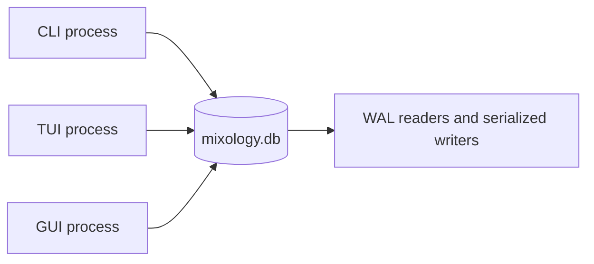



Mixology started with [bstore](https://github.com/mjl-/bstore). That was a productive choice. Typed Go rows, transactions, indexes, and typed queries let the application develop its bounded contexts without first building a persistence layer.

The application eventually grew three independent entrypoints over one local database: a CLI, a persistent Bubble Tea TUI, and a Fyne desktop client. Opening one surface should not require closing another. That made process-level database coordination part of the product behavior rather than an implementation detail, and Mixology moved its embedded store to SQLite.

This was a storage replacement, not a claim that the original choice had been a mistake. The interesting test was whether the application had put its boundaries in useful places. A successful migration would change the database mechanics while preserving domain ownership, operation pipelines, transactional event handling, typed filters, and the behavior seen by all three surfaces.

## Preserve the boundary, replace its engine

The old `pkg/store` wrapped bstore and exposed database lifecycle, read and write helpers, transaction context, and application error mapping. Domain DAOs still imported bstore query and transaction types directly, so the adapter was concrete even though database opening was centralized.

The SQLite version makes that boundary fully application-owned:

```go
type Store struct { /* database/sql pool */ }
type Tx struct { /* read or immediate-write transaction */ }
type Query[T any] struct { /* predicates, order, residuals */ }
```

Commands and handlers still obtain a transaction through `store.Context`. DAOs still build typed queries over private row structs. Middleware still places the command mutation, domain event handlers, and successful audit record in one transaction. The types crossing those seams now belong to Mixology rather than its former storage dependency.

That distinction also made the migration reviewable. Most DAO edits translated like for like: `bstore.QueryTx` became `store.QueryTx`, bstore transactions became `store.Tx`, and bstore tags became application-owned `store` tags. Domain models, commands, queries, policies, events, and surface adapters did not need a persistence vocabulary change.

## Use SQLite without turning every DAO into SQL

Mixology stores each private row as JSON in a shared `records` table, keyed by its Go model identity and row ID. The typed query API translates field comparisons into parameterized `json_extract` predicates:

```sql
SELECT data
FROM records
WHERE model = ?
  AND json_extract(data, '$.Status') = ?
ORDER BY julianday(json_extract(data, '$.CreatedAt')) DESC
```

This retains the row-oriented programming model the domains already used while gaining SQLite's file coordination, constraints, and query execution. It is a concrete tradeoff, not a universal persistence abstraction. JSON records keep the migration bounded; expression indexes make selected fields queryable; residual Go predicates remain available for conditions that cannot be represented safely in SQL.

Each domain registers its own private rows during explicit application composition:

```go
type DrinkRow struct {
    ID       string
    Revision uint64 `json:"-" store:"revision"`
    Name     string `store:"unique"`
}

func Register(ctx context.Context, s *store.Store) {
    s.Register(ctx, DrinkRow{})
}
```

Registration creates declared expression indexes and unique constraints idempotently. Competing processes therefore rely on database constraints rather than check-then-insert conventions. Registration happens in constructors, so importing a domain cannot mutate a database schema as a side effect.

## Make process coordination an explicit runtime property

SQLite opens the local database in WAL mode with foreign keys enabled, `synchronous=NORMAL`, and a ten-second busy timeout. The pool permits concurrent readers, while SQLite serializes writers. Write transactions begin immediately, avoiding a deferred read transaction that later fails while trying to upgrade itself.



The guarantee is deliberately local. Several processes on one machine may open the same file and observe committed changes on their next query. The file is not shared across machines or placed on a network filesystem.

Long-lived clients also need to know when that next query is useful. `Store.MonitorChanges` pins a connection and polls `PRAGMA data_version`. A commit made through another connection advances that connection-local value and produces a coalesced invalidation hint. The hint contains no records and is not a durable event stream. The GUI and TUI respond through their normal application queries, so authorization, filtering, paging, and hydration remain on the same path as manual refresh. Rolled-back work does not signal, and reconnecting invalidates once because a commit may have occurred while the monitor was unavailable.

That distinction keeps observation separate from domain messaging. Several commits may collapse into one signal, and the receiving client does not infer which entity changed. It simply knows that cached data may be stale. An active editor retains its unsaved input and reloads after the workflow ends, while asynchronous request tokens prevent an older reload from replacing a newer one.

## Make stale writes fail at the store boundary

Refresh reduces stale windows, but it cannot close the race between reading a row and writing it. Rows opt into optimistic concurrency with a `revision` tag. Insert requires revision zero and establishes revision one. Reads return the current token. Update and delete include the expected revision in their SQL predicate, and update advances the value atomically.

If another process or unit of work has already advanced the row, the predicate matches nothing and the store returns a typed conflict. Public domain models and presentation DTOs round-trip the token, but they do not compare or calculate it. The invariant stays beside the write, where it cannot become a check-then-update race. A stale GUI or TUI form therefore cannot silently replace a newer CLI change even when its refresh signal has not arrived yet.

## Keep transactional domain behavior intact

Mixology's most important persistence property is larger than a row update. A command can mutate its own domain, publish an event to several bounded contexts, and record an audit entry. Those changes either commit together or roll back together.

The unit-of-work middleware still owns that lifecycle. Read operations use ordinary read transactions. Write operations acquire an immediate SQLite transaction and carry its application-owned `*store.Tx` through the command and leaf event handlers. A serializer prevents concurrent goroutines from using the same transaction object, while SQLite coordinates independent transactions and processes.

Tests exercise the boundary with real temporary databases. They verify commit and rollback, concurrent store handles, optimistic conflicts, committed-change signals, startup registration, unique constraints, migration ledgers, future schema rejection, filtering, and the existing application workflows. The migration changed the engine without weakening the transaction that gives cross-domain reactions their meaning.

## Move filtering by preserving semantics

The [typed filtering layer](/articles/typed-filtering-over-sqlite/) was intentionally concrete about bstore. Its first adapter translated checked Expr trees into bstore filters, hydrated tags, and evaluated the complete expression as a residual authority.

The SQLite migration did not invent a supposedly neutral query language to hide that history. It replaced `ApplyBstore` and `ApplyBstorePushdowns` with `ApplySQL` and `ApplySQLPushdowns`. Safe comparisons now become predicates in the application-owned typed store query, which emits SQL over JSON fields. Hydrated data still joins the candidate row before exact expression evaluation.

That is the portability boundary I want: callers retain one typed expression contract, each database gets an honest execution adapter, and the complete predicate determines the answer. The implementation can use the current database well without exposing its syntax as the application's public language.

## Give storage errors application meaning

bstore exposed sentinel errors for absence, uniqueness, and invalid zero values. The SQLite store now produces the application's typed not-found, conflict, and invalid errors directly. Constraint result codes are recognized at the store boundary, and `MapError` adds operation-specific context while preserving the error kind. Unexpected driver failures become internal errors.

That keeps transports independent of persistence. CLI exit behavior, TUI messages, GUI dialogs, HTTP status mappings, and gRPC status mappings can all respond to the same immutable application kind. A database migration should not teach every surface how to recognize a new driver's errors.

## Treat the file format honestly

A bstore database is a bbolt file, not a SQLite database. Mixology does not attempt to open it as one or silently rewrite it during startup. Disposable sample data can be reseeded. Data that matters must be exported with the previous application version and imported into a fresh SQLite database, with the original retained until verification is complete.

The SQLite schema has its own ordered migration ledger. Startup creates `schema_migrations`, applies missing versions in an immediate transaction, rejects a database newer than the application understands, and keeps domain data backfills explicit and idempotent. Future SQLite releases can evolve this format normally, but crossing from bstore remains an explicit data migration.

That sharp edge is useful documentation. An API boundary can survive while an on-disk representation does not. Calling both “embedded databases” never made their files interchangeable.

## Let a migration test the architecture

The move changed the driver, database format, concurrency model, schema lifecycle, query implementation, index declarations, filter adapter, transaction types, and low-level errors. It did not change Mixology's seven bounded contexts, public command and query contracts, Cedar policies, transactional event semantics, or three presentation surfaces.

That is evidence for the architecture rather than proof of a magical persistence abstraction. Mixology was coupled to bstore where concrete execution benefited from it. It was decoupled where callers needed durable meaning. Replacing the former while preserving the latter is what made the migration both substantial and bounded.
