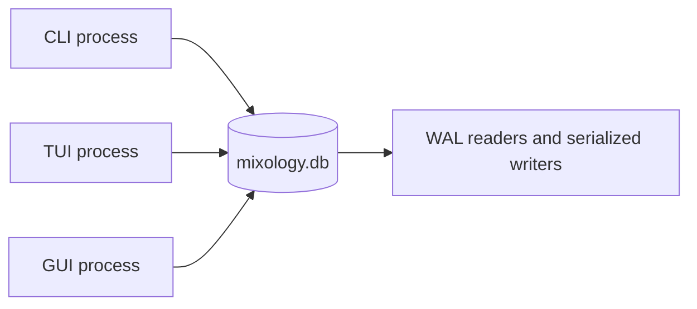



Mixology started with [bstore](https://github.com/mjl-/bstore). That was a productive choice. Typed Go rows, transactions, indexes, and typed queries let the application develop its bounded contexts without first building a persistence layer.

The application eventually grew three independent entrypoints over one local database: a CLI, a persistent Bubble Tea TUI, and a Fyne desktop client. Opening one surface should not require closing another. That made process-level database coordination part of the product behavior rather than an implementation detail, and Mixology moved its embedded store to SQLite.

This was a storage replacement, not a claim that the original choice had been a mistake. The interesting test was whether the application had put its boundaries in useful places. A successful migration would change the database mechanics while preserving domain ownership, operation pipelines, transactional event handling, typed filters, and the behavior seen by all three surfaces.

## Preserve the boundary, replace its engine

The old `pkg/store` wrapped bstore and exposed database lifecycle, read and write helpers, transaction context, and application error mapping. Domain DAOs still imported bstore query and transaction types directly, so the adapter was concrete even though database opening was centralized.

The SQLite version makes that boundary fully application-owned:

```go
type Store struct { /* database/sql pool */ }
type Tx struct { /* read or immediate-write transaction */ }
type Query[T any] struct { /* predicates, order, residuals */ }
```

Commands and handlers still obtain a transaction through `store.Context`. DAOs still build typed queries over private row structs. Middleware still places the command mutation, domain event handlers, and successful audit record in one transaction. The types crossing those seams now belong to Mixology rather than its former storage dependency.

That distinction also made the migration reviewable. Most DAO edits translated like for like: `bstore.QueryTx` became `store.QueryTx`, bstore transactions became `store.Tx`, and bstore tags became application-owned `store` tags. Domain models, commands, queries, policies, events, and surface adapters did not need a persistence vocabulary change.

## Use SQLite without turning every DAO into SQL

The first SQLite adapter kept private rows as JSON documents in a shared `records` table. That changed the engine but left the data in a document layout. The [relational revision](https://github.com/TheFellow/go-modular-monolith/pull/65) completes that work: each registered model now has a named `STRICT` table, scalar fields become typed columns, nested structs flatten into columns, and collections become ordered child tables.

Typed queries still belong to the application, but their predicates now address columns directly. For example, the orders status-and-cursor access path has this SQL shape:

```sql
SELECT id, __revision AS revision, status, created_at
FROM orders
WHERE status = ? AND id < ?
ORDER BY id DESC
```

Owned children reference their parent through foreign keys with cascading deletion. A unique parent/position key preserves collection order; maps also enforce unique keys within each parent. Recipe ingredients, menu entries, accepted order snapshots, amendment history, and audit details all use this relational layout. References across domain boundaries remain correlation identities, so deleting a catalog item cannot erase accepted order or audit history.

Timestamps use fixed-width UTC text with nanosecond precision, and decimal amounts use lossless scalar text. Presence columns preserve absent optional values and distinguish nil collections from empty ones. No aggregate is serialized as JSON. The [schema implementation](https://github.com/TheFellow/go-modular-monolith/blob/1b6a586180c116eb1231b3e108e151879881b69b/pkg/store/schema.go) makes those encodings explicit.

Each domain registers its own private rows during explicit application composition:

```go
type DrinkRow struct {
    ID       string
    Revision uint64 `json:"-" store:"revision"`
    Name     string `store:"unique"`
}

func (DrinkRow) StoreModelName() string { return "drinks" }

func Register(ctx context.Context, s *store.Store) {
    s.Register(ctx, DrinkRow{})
}
```

`StoreModelName` declares a stable table name independent of the Go package path. Registration creates tables, column indexes, and unique constraints idempotently. It happens in constructors, so importing a domain cannot mutate a database schema as a side effect. Competing processes rely on database constraints rather than check-then-insert conventions.

Indexes follow the queries that read the data. Orders declare `store:"index=Status+ID"` for status plus cursor, inventory movements use inventory ID plus timestamp and ID, and audit uses principal type plus principal ID and ID. Tag associations enforce uniqueness on entity type, entity ID, and key, with a separate key/value/entity index for discovery. Child ownership keys support hydration and cascading deletion. [Query-plan tests](https://github.com/TheFellow/go-modular-monolith/blob/1b6a586180c116eb1231b3e108e151879881b69b/pkg/store/relational_test.go) use `EXPLAIN QUERY PLAN` to check representative access paths.

## Make process coordination an explicit runtime property

SQLite opens the local database in WAL mode with foreign keys enabled, `synchronous=NORMAL`, and a ten-second busy timeout. The pool permits concurrent readers, while SQLite serializes writers. Write transactions begin immediately, avoiding a deferred read transaction that later fails while trying to upgrade itself.



The guarantee is deliberately local. Several processes on one machine may open the same file and observe committed changes on their next query. The file is not shared across machines or placed on a network filesystem.

Long-lived clients also need to know when that next query is useful. `Store.MonitorChanges` pins a connection and polls `PRAGMA data_version`. A commit made through another connection advances that connection-local value and produces a coalesced invalidation hint. The hint contains no records and is not a durable event stream. The GUI and TUI respond through their normal application queries, so authorization, filtering, paging, and hydration remain on the same path as manual refresh. Rolled-back work does not signal, and reconnecting invalidates once because a commit may have occurred while the monitor was unavailable.

That distinction keeps observation separate from domain messaging. Several commits may collapse into one signal, and the receiving client does not infer which entity changed. It simply knows that cached data may be stale. An active editor retains its unsaved input and reloads after the workflow ends, while asynchronous request tokens prevent an older reload from replacing a newer one.

## Make stale writes fail at the store boundary

Refresh reduces stale windows, but it cannot close the race between reading a row and writing it. Rows declare optimistic concurrency with a `revision` tag. Architecture tests now require revision fields on registered domain records. Insert requires revision zero and establishes revision one. Reads return the current token. Update and delete include the expected revision in their SQL predicate, and update advances the value atomically.

If another process or unit of work has already advanced the row, the predicate matches nothing and the store returns a typed conflict. Public domain models and presentation DTOs round-trip the token without calculating its next value. Commands may compare a submitted token with the loaded state for an early conflict, but the SQL predicate remains authoritative at the write. A stale GUI or TUI form therefore cannot silently replace a newer CLI change even when its refresh signal has not arrived yet.

## Keep transactional domain behavior intact

Mixology's most important persistence property is larger than a row update. A command can mutate its own domain, publish an event to several bounded contexts, and record an audit entry. Those changes either commit together or roll back together.

The unit-of-work middleware still owns that lifecycle. Read operations use ordinary read transactions. Write operations acquire an immediate SQLite transaction and carry its application-owned `*store.Tx` through the command and leaf event handlers. A serializer prevents concurrent goroutines from using the same transaction object, while SQLite coordinates independent transactions and processes.

Tests exercise the boundary with real temporary databases. They verify commit and rollback, concurrent store handles, optimistic conflicts, committed-change signals, startup registration, unique constraints, migration ledgers, future schema rejection, filtering, and the existing application workflows. The migration changed the engine without weakening the transaction that gives cross-domain reactions their meaning.

The relational tests also verify scalar round-trips, optional presence, collection ordering, child constraints, and stale revisions. Per-operation savepoints keep a failed aggregate write from leaving partially updated parent or child rows inside a caller-owned transaction. The existing domain workflows continue to exercise the wider command transaction.

The current application also uses expected revisions for absolute stock sets and lifecycle commands, and captured complete tag sets for guarded editor replacements. SQLite writer serialization cannot detect stale user intent on its own. One domain command owns each transaction, including its leaf handlers and successful audit activity. Middleware rejects nested commands from command, query, or handler contexts, and the store rejects a second command claiming the same transaction, even through a fresh context after the first returns. When middleware owns rollback, it records the command's attempted effects afterward. A caller injecting a transaction for low-level tests retains rollback and failure-recording responsibility.

Tag associations now live under `tagging/internal/dao`. Their private row declares the `entity_tags` table and its lookup and uniqueness indexes. A consuming domain accepts an optional `tag.Edit` and publishes its own `TagsReplaced` event; Tagging prepares validation, expected-set comparison, and authorization during `Handling`, then writes its own associations during `Handle`. Entity and tag changes therefore remain inside the owning command's transaction.

## Move filtering by preserving semantics

The [typed filtering layer](/articles/typed-filtering-over-sqlite/) was intentionally concrete about bstore. Its first adapter translated checked Expr trees into bstore filters, hydrated tags, and evaluated the complete expression as a residual authority.

The SQLite migration did not invent a supposedly neutral query language to hide that history. It replaced `ApplyBstore` and `ApplyBstorePushdowns` with `ApplySQL` and `ApplySQLPushdowns`. Safe comparisons now become predicates in the application-owned typed store query, which emits SQL over typed columns. Hydrated data still joins the candidate row before exact expression evaluation.

That is the portability boundary I want: callers retain one typed expression contract, each database gets an honest execution adapter, and the complete predicate determines the answer. The implementation can use the current database well without exposing its syntax as the application's public language.

## Give storage errors application meaning

bstore exposed sentinel errors for absence, uniqueness, and invalid zero values. The SQLite store now produces the application's typed not-found, conflict, and invalid errors directly. Constraint result codes are recognized at the store boundary, and `MapError` adds operation-specific context while preserving the error kind. Unexpected driver failures become internal errors.

That keeps transports independent of persistence. CLI exit behavior, TUI messages, GUI dialogs, HTTP status mappings, and gRPC status mappings can all respond to the same immutable application kind. A database migration should not teach every surface how to recognize a new driver's errors.

## Treat the file format honestly

The relational schema starts from fresh teaching data. Both legacy bstore/bbolt files and the previous SQLite document layout are incompatible. Startup rejects a database containing the old `records` table with an actionable reset error; it does not convert or backfill those documents.

Close every application process, choose a fresh database path, and seed it from the application repository:

```sh
export MIXOLOGY_DB=./data/relational-demo.db
go run ./main/seed
```

The seeder adds sample data; it does not reset or upgrade an existing database. The [reset instructions](https://github.com/TheFellow/go-modular-monolith/blob/1b6a586180c116eb1231b3e108e151879881b69b/docs/development.md#teaching-data-and-schema-changes) also cover removing an old database and its WAL sidecars. Startup retains a versioned `schema_migrations` ledger and rejects future schema versions. Registration describes the current schema; it does not automatically alter existing domain tables. There is no backward-compatibility requirement for this teaching data.

That sharp edge is useful documentation. An API boundary can survive while an on-disk representation does not. Calling both “embedded databases” never made their files interchangeable.

## Let a migration test the architecture

The move changed the driver, database format, concurrency model, schema lifecycle, query implementation, index declarations, filter adapter, transaction types, and low-level errors. It did not change Mixology's seven bounded contexts, public command and query contracts, Cedar policies, transactional event semantics, or three presentation surfaces.

That is evidence for the architecture rather than proof of a magical persistence abstraction. Mixology was coupled to bstore where concrete execution benefited from it. It was decoupled where callers needed durable meaning. Replacing the former while preserving the latter is what made the migration both substantial and bounded.
