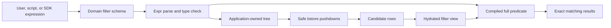
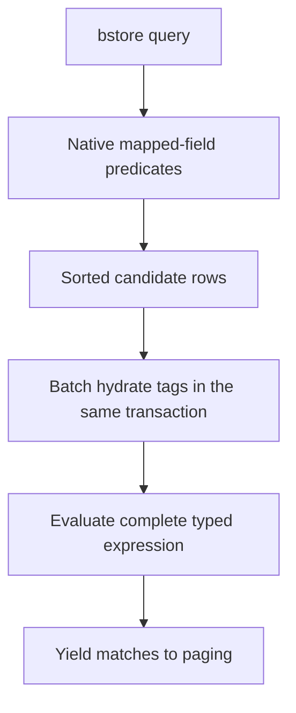



[Mixology](https://github.com/TheFellow/go-modular-monolith) originally had the usual collection of list parameters: exact name, category, status, time bounds, and a few domain-specific switches. Those parameters remain useful for common workflows, but they do not compose into questions such as:

```text
category == "cocktail" && (name.contains("gin") || tags contains "featured")
```

I wanted one filtering model that was natural at a prompt, stable in a script, discoverable without reading Go, and reusable by an SDK or another presentation surface. I also wanted it to use the database Mixology actually has. The result is a typed expression contract built with [Expr](https://expr-lang.org/) and a deliberately bstore-aware execution path.

That combination matters. The public language is broader than bstore's native predicates, while the implementation knows enough about bstore to avoid evaluating every simple comparison as an opaque Go callback. General at the application boundary and concrete at the persistence boundary are complementary choices.

## Start with the product language

Every filterable domain list request accepts a `Filter` string. The CLI exposes it as `--filter`, the TUI and GUI preserve the same expression in their list state, and callers of the Go modules can construct the same request directly. A single expression travels across these boundaries without turning the public API into a database query builder.

The language supports comparisons, membership, parentheses, Boolean logic, string predicates, regular expressions, and checked time literals. It accepts both programmer-oriented operators and readable words:

```text
status == "published" && name.contains("summer")
status == "published" and name contains "summer"
started_at >= date("2026-07-01T00:00:00Z") && !success
```

This is useful for two different kinds of consumer. A person can type an expression that reads like the question they are asking. A script can pass one string, retain it in configuration, and combine predicates without learning a growing matrix of flags. An SDK can offer a string today or build a typed expression representation later without inheriting bstore vocabulary.

Mixology does not expose all of Expr. Arithmetic, arbitrary function calls, and dynamic constructs are rejected. The accepted language is intentionally small enough to document, validate, format canonically, and translate safely. `date` and `duration` require literal arguments, and regular expressions are compiled during parsing. Misspelled fields, incompatible comparisons, malformed dates, and invalid patterns fail before a query executes.

## Make each domain describe its own filter

The shared package supplies the language mechanics, but each domain owns the fields that make sense for its list. Inventory, for example, defines a view specifically for filtering:

```go
type ListFilterView struct {
    ID           string    `expr:"id" filter:"Inventory ID" filter-column:"InventoryID"`
    IngredientID string    `expr:"ingredient_id" filter:"Ingredient ID" filter-column:"IngredientID"`
    Quantity     float64   `expr:"quantity" filter:"Quantity on hand" filter-column:"Quantity"`
    Unit         string    `expr:"unit" filter:"Measurement unit" filter-column:"Unit"`
    LastUpdated  time.Time `expr:"last_updated" filter:"Last update timestamp" filter-column:"LastUpdated"`
    Tags         []string  `expr:"tags" filter:"Tags (key or key=value)"`
}
```

These tags carry three related decisions. `expr` names the public field, `filter` describes it to a user, and `filter-column` explicitly maps a persisted field to bstore. Tags have no column because they are loaded from the shared tagging subsystem after the primary rows are selected.

[`NewSchema`](https://github.com/TheFellow/go-modular-monolith/blob/main/pkg/filter/filter.go) reflects over that concrete type and collects fields, descriptions, types, and examples. The same schema compiles expressions and generates `--filter-help`, so the documentation printed by a command cannot quietly drift away from the fields its application operation accepts. Schema examples are parsed in tests as well as shown to users.

The filtering view is not necessarily the stored row or the returned domain model. Drinks can expose `recipe.garnish`; Audit can present complete Cedar entity UIDs assembled from stored type and ID columns; every taggable domain can expose its hydrated tag strings. The application chooses a useful query vocabulary instead of publishing its storage layout by accident.

## Borrow a compiler, own the contract

Expr provides a mature parser, type checker, optimizer, and virtual machine. Reusing it avoided inventing precedence rules, field checking, and expression evaluation. Mixology turns off optimization while compiling so the source structure remains available for conservative planning, then patches a few spellings into one semantic form. For example, `name.contains("gin")` and `name contains "gin"` become equivalent, as do `tags.contains("featured")` and `tags contains "featured"`.

Depending on Expr does not make Expr's AST the application contract. After compilation, the filter package converts the accepted expression into its own small tree:

```go
type Node struct {
    Kind     Kind
    Name     string
    Operator string
    Value    any
    Children []Node
}
```

Only fields, literals, lists, checked calls, unary logic, and the supported binary operators can enter this tree. The expression also retains its original source, a canonical string, its typed schema, and the compiled Expr program.

Those representations serve different jobs. The source is what a caller supplied. The canonical form gives logs, saved filters, tests, and future SDKs a stable spelling. The application-owned tree supports planning without coupling persistence code to Expr internals. The compiled program evaluates the complete predicate against a typed view.



This is a narrow abstraction with a concrete purpose. It gives Mixology ownership of its public language and planner while letting Expr do the compiler work it already does well.

## Push down only what remains true

[bstore](https://github.com/mjl-/bstore) provides typed query operations such as `FilterEqual`, `FilterGreaterEqual`, `FilterLess`, and `FilterFn`. Mixology maps top-level required comparisons onto those operations when a schema field explicitly names a `filter-column`.

For this expression:

```text
category == "spirit" && (name.contains("gin") || tags contains "featured")
```

`category == "spirit"` is a safe pushdown. Every row satisfying the whole expression must satisfy that conjunct, and `Category` is a mapped persisted column. The nested `or` is not pushed. Selecting only gin names or only featured tags would discard valid results, and tags are not present on the primary bstore row anyway.

The planner is conservative by construction. It descends through `&&`, translates comparisons with literal values, reverses comparisons when the field appears on the right, converts checked literal values to the concrete column type, and maps `in` or `not in` to bstore's equality operations. It does not attempt Boolean algebra, infer storage mappings, or translate string operations that bstore does not natively express.

After bstore applies those constraints, Mixology still evaluates the complete compiled expression. This residual check is not merely a fallback for unsupported syntax. It is the semantic authority. Pushdowns may reduce the candidate set, but they never redefine the filter.

## Let bstore shape the execution path

There are two integrations because Mixology has two kinds of filter view.

Audit fields can be projected completely from one `AuditEntryRow`. [`ApplyBstore`](https://github.com/TheFellow/go-modular-monolith/blob/main/pkg/filter/bstore.go) adds safe native constraints and installs a `FilterFn` that projects each candidate row and evaluates the full expression inside the bstore query.

Tags require a staged path. Drinks, Ingredients, Inventory, Menus, and Orders first call `ApplyBstorePushdowns`, sort and load the candidate rows, then fetch all corresponding tags within the same read transaction. Each row and its tags become the domain's filter view, and `Expression.Match` applies the complete predicate before the iterator yields it to paging and authorization.



This is intentionally not a persistence-neutral repository specification. bstore's typed query API, `FilterFn`, transaction model, sorting, and row structs directly shape the adapter. Pretending those capabilities are interchangeable with an unknown future database would add an internal query language and still require a bstore translator underneath it.

The product semantics are insulated at the useful boundary instead. Domain modules accept typed list requests. Domain schemas define the public fields. The application owns the checked tree and canonical expression. The DAO uses bstore as bstore, including its native comparisons and in-process predicates. If Mixology adopts another store, the new work is an honest execution adapter and planner, not proof that the old adapter was secretly generic.

## Preserve filtering through paging and authorization

Filtering is part of a public list operation, not a CLI post-processing step. The module parses the expression before entering the query pipeline and passes the compiled result to its DAO filter. The DAO yields only complete matches. Cursor paging therefore counts matching authorized items rather than fetching a page and removing rows afterward.

That placement also keeps authorization intact. The middleware still applies the domain's list action and result-aware policy around the query. A filter can narrow the resources a principal asks for, but it cannot widen what that principal may read.

Tests cover the boundaries where the design could lose meaning: aliases round-trip to one canonical spelling, unknown constructs fail, invalid runtime literals fail during parsing, `or` expressions are not pushed unsafely, date comparisons reach native bstore filters, tag predicates run after hydration, every domain field is exercised, and filtered paging continues across enough stored rows to reveal post-page filtering mistakes.

## Carry the boundary into the .NET port

The completed [.NET semantic port](/projects/modular-monolith/) now applies the same division with [Expr for .NET](/projects/expr-dotnet/) and EF Core. [`Mixology.Filtering`](https://github.com/TheFellow/modular-monolith/tree/master/src/Mixology.Filtering) originally owned a lexer, parser, checker, formatter, and evaluator while the Expr package was being built. The 0.1.0 integration removes that duplicate language machinery. Expr now supplies the checked public AST, canonical printer, optimizer, and exact virtual-machine evaluation.

The adapter still owns the useful application contract. Typed domain schemas build strict Expr environments. An AST rewriter preserves established Mixology spellings and maps dotted public field names onto environment members. Constant validation and error translation keep invalid filters inside the application's error model. The EF planner inspects the checked Expr tree and emits an `Expression<Func<TRow, bool>>` only for constraints implied by the complete predicate.

EF applies that expression to select candidates, the repository hydrates fields such as tags, and the compiled Expr program evaluates the complete public view before paging and authorization. This is the same correctness rule as the bstore path even though the mechanisms differ. A pushdown narrows work; it never defines the answer.

The comparison also sharpens what it means for an application to own its filtering language. The Go adapter converts accepted Expr syntax into a small application tree. The .NET adapter can plan directly over Expr for .NET's deliberately public immutable AST. Ownership does not require maintaining a private parser or node hierarchy. It requires controlling the exposed schema, accepted compatibility, public errors, safe translations, and final evaluation boundary.

## General where callers benefit, concrete where execution benefits

The filtering implementation is reusable because its public concepts are stable: a domain schema, a checked expression, a small tree, canonical text, and exact evaluation against a typed view. None of those concepts requires a CLI or bstore to make sense.

Its execution is deliberately specific. Explicit field mappings opt into bstore pushdown. Native bstore filters reduce candidates. `FilterFn` handles complete row-local predicates. Staged hydration handles application data that is not on the row. The full expression closes the semantic loop.

This division avoids two weak compromises. Users do not have to speak in bstore columns and query methods, and persistence code does not have to ignore useful features in the name of hypothetical portability. Mixology owns the language people and programs use, then follows through with an implementation designed for the database it actually runs.
