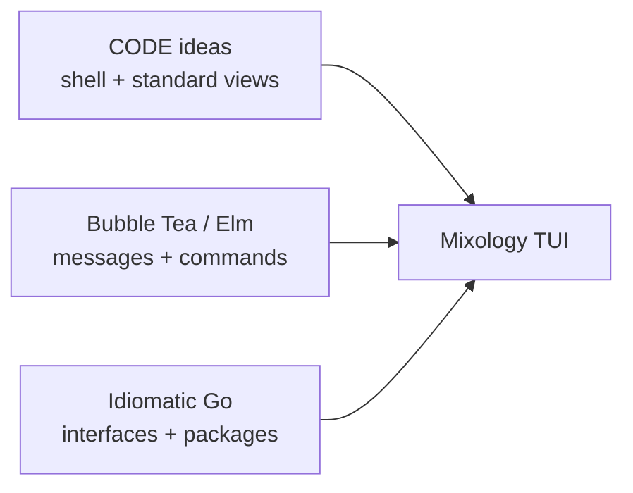
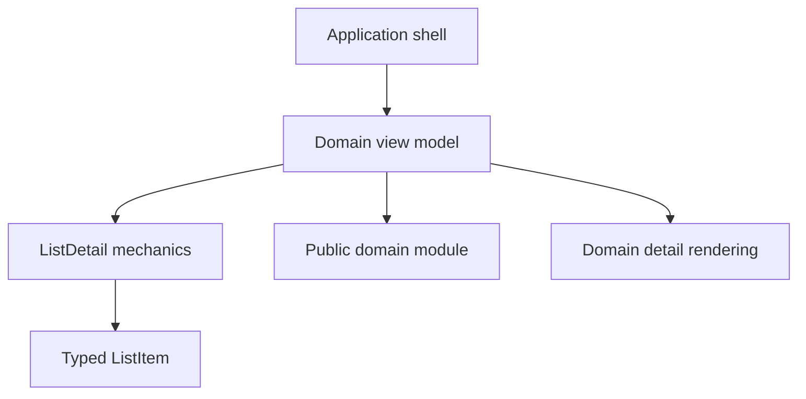
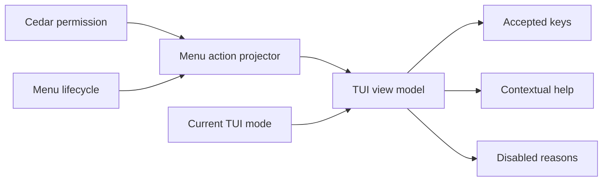
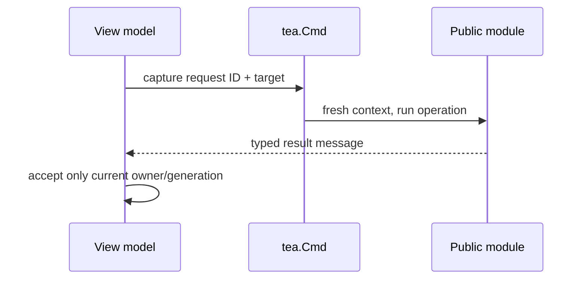

<!-- Generated from https://thefellow.github.io/articles/building-an-application-tui-toolkit/ by scripts/generate_llm_content.py; do not edit. -->

# Building an Application TUI Toolkit

Source: [https://thefellow.github.io/articles/building-an-application-tui-toolkit/](https://thefellow.github.io/articles/building-an-application-tui-toolkit/)

## Pyramid summary

- **~2 words:** Testable TUI
- **~8 words:** How Mixology adapts MVVM and Elm ideas into an application toolkit.
- **Expanded:** How Mixology combines proven MVVM ideas with Bubble Tea's message loop to create a consistent, testable terminal application without inventing another framework.

## Full content

**Part 5 of [Building Mixology](/series/mixology.md).**

A terminal application can become a pile of `switch` statements surprisingly quickly. The first screen owns a list and a few keys. The second needs a form. Then Escape means “go back” in one place, “close the dialog” in another, and a literal character in a filter. Loading completes after the user has left a screen. Every feature still works, but no one can say with confidence who owns the next message.

[Mixology](https://github.com/TheFellow/go-modular-monolith) takes a different route. Its TUI has a root application shell, domain-owned view models, and a small reusable presentation toolkit. Those choices borrow deliberately from [CODE Framework's standard views and view-models](https://docs.codeframework.io/Standard-Views-and-View--Models), while the program actually runs through [Bubble Tea's implementation of The Elm Architecture](https://github.com/charmbracelet/bubbletea#the-elm-architecture). Go supplies the final shape: interfaces instead of base classes, typed messages instead of binding notifications, explicit constructors instead of runtime discovery, and package rules instead of architectural wishes.

This is not an attempt to build a universal MVVM framework. It is an application toolkit: enough shared vocabulary to make Mixology feel like one product, with domain behavior left where it belongs.

## Two lineages, one deliberate adaptation

CODE Framework is useful here for its application-level ideas. A shell coordinates the experience. Standard views turn recurring business-application layouts into known conventions. View models supply state and actions without knowing a particular visual representation. Shared controls and themes create a common language without requiring every screen to have identical behavior. CODE's [WPF overview](https://docs.codeframework.io/Understanding-WPF) describes that combination of MVVM, standard views, and application infrastructure.

Bubble Tea contributes a different kind of foundation. A model holds state; `Update` consumes a message and returns a new model plus an optional command; `View` renders the current state. Commands perform asynchronous work and return more messages. [Bubbles](https://github.com/charmbracelet/bubbles) demonstrates how smaller models, key maps, help, lists, text inputs, and spinners compose inside that loop.

Mixology uses both, but copies neither literally. It has no XAML, binding engine, `INotifyPropertyChanged`, command base class, or dependency-injection container. A Go view model is an ordinary struct. A change becomes visible because `Update` changes the struct and Bubble Tea calls `View` again. An action is a `tea.Cmd`, and its result is a typed `tea.Msg`.



Together, these influences give Mixology both an application structure and a runtime discipline. CODE Framework inspires the shell, standard-view conventions, and view-model boundaries; Bubble Tea supplies the message loop, commands, and composable models; and Go turns those ideas into explicit interfaces, typed messages, and package boundaries.

## The shell owns the application

The [`App` root model](https://github.com/TheFellow/go-modular-monolith/blob/main/main/tui/app.go) is the terminal equivalent of an application shell. It owns the current route, back stack, cached view models, outer title and status bars, global help, terminal dimensions, and application-wide keys. It also constructs each domain surface explicitly.

That ownership answers questions that otherwise leak into every screen:

- Which view is active, and what was active before it?
- Should returning to a view preserve its local selection and filter?
- How much vertical space remains after the title, status, and help areas?
- Does Escape navigate globally or belong to the current modal interaction?
- Which help bindings should the footer display now?

Views are initialized lazily and cached in a map. Navigation to an existing view restores its presentation state; a new view is sized before its initialization command can produce a renderable result. The dashboard is deliberately rebuilt when revisited because its summary should be fresh. These are application policies, not responsibilities of a generic list component.

The shell also keeps the application session in one place. Domain surfaces receive that session and call public modules, so CLI and TUI operations travel through the same authorization, transaction, audit, and event pipeline.

## A small view-model contract

Every top-level domain surface implements the repository-owned [`tui.ViewModel` interface](https://github.com/TheFellow/go-modular-monolith/blob/main/pkg/toolkits/tui/view.go). It does not implement `tea.Model` directly:

```go
type ViewModel interface {
    Init() tea.Cmd
    Update(tea.Msg) (ViewModel, tea.Cmd)
    View() string
    ShortHelp() []key.Binding
    FullHelp() [][]key.Binding
    Interaction() Interaction
}
```

The first three methods adapt Bubble Tea's vocabulary while preserving the narrower return type. The root `main/tui.App` is the only application-level `tea.Model`; it hosts the active `tui.ViewModel`, accepts its replacement value after `Update`, and remains responsible for routing, invalidation, framing, and process-wide keys. The help methods let that shell render a consistent footer without knowing a domain's commands. `Interaction` is the application-specific addition:

```go
type Interaction struct {
    CapturesText bool
    HandlesBack  bool
}
```

Input ownership changes with state. A list that is filtering captures printable characters. A form or dialog handles Escape itself. A browsing list can leave Escape to the shell. The shell asks the active view before interpreting a global key, and it also defers database invalidation while the view owns an interaction. Once the form, filter, or dialog yields ownership, the shell delivers a `DataInvalidatedMsg` and the domain view model reloads through its ordinary authorized query. The contract therefore prevents application shortcuts from stealing text, avoids dismissing the wrong layer, and keeps an external commit from overwriting an active edit.

This tiny protocol does work that desktop frameworks often hide in focus systems, routed commands, and modal window ownership. Making it explicit fits a terminal event loop: the active view declares what it owns *now*, and tests can assert the declaration directly.

## Domain surfaces remain domain-owned

Top-level domain view models live below [`app/domains/*/surfaces/tui`](https://github.com/TheFellow/go-modular-monolith/tree/main/app/domains). Drinks knows how to create a recipe, Menus knows what publishing means, and Orders knows whether completion or cancellation is available. Those decisions do not belong in `pkg/toolkits/tui` simply because they happen to be triggered by a key.

A typical list view model combines four kinds of state:

- A reusable list/detail model for terminal mechanics.
- Typed domain selection and detail state.
- An explicit workflow mode such as browsing, creating, editing, tagging, or confirming deletion.
- Commands that call public application modules and return typed result messages.

The mode is a small state machine in ordinary Go. It determines which child receives a message, which help is visible, and whether the view owns Back. This is the practical replacement for a collection of visibility bindings and enabled-command expressions.

Commands obtain a fresh operation context when they execute. The long-lived TUI session preserves the authenticated principal, but middleware state such as touched entities and pending events must not leak from one click to the next. A surface therefore calls the session's context factory for each public module operation rather than retaining one mutable middleware context for the lifetime of the screen.

The package boundary is equally important. Surfaces call exported domain modules and queries; they do not reach into a DAO or private command implementation. Presentation logic can coordinate an application operation without becoming another route around the application.

## Standard views, translated into terminal mechanics

CODE Framework's standard views are not copied as a catalog of WPF templates. Their underlying lesson is retained: when several business screens share presentation mechanics, give those mechanics one tested implementation and let each domain supply the meaning.

[`pkg/toolkits/tui.ListDetail`](https://github.com/TheFellow/go-modular-monolith/blob/main/pkg/toolkits/tui/list_detail.go) is the clearest example. It owns:

- Bubbles list configuration, filtering, pagination, and selection.
- Loading and spinner state.
- Error presentation.
- Window sizing and the list/detail pane split.
- The final horizontal composition of the panes.

It deliberately does not load drinks, decide whether a menu can be published, format an order, or choose what happens after deletion. Its caller retains the command, typed selection, detail renderer, and workflow state.

[`ListItem[T]`](https://github.com/TheFellow/go-modular-monolith/blob/main/pkg/toolkits/tui/item.go) completes the adapter. It keeps the real typed domain value while supplying the title, description, and filter text Bubbles expects. A caller does not surrender type safety merely to enter a general list.

That division gives Mixology a standard list/detail language without creating a giant base view model:



The abstraction is intentionally opinionated. `ListDetail` implements Mixology's searchable split-pane experience, including its proportions and Bubbles choices. Reusable does not have to mean configurable in every conceivable direction.

## Small controls, explicit dependencies

The rest of [`pkg/toolkits/tui`](https://github.com/TheFellow/go-modular-monolith/tree/main/pkg/toolkits/tui) forms the lower-level toolkit:

- `forms` manages field selection, explicit edit mode, validation, dirty and submitted state, sizing, and text, number, and select fields.
- `dialog` implements confirmation and cancellation as messages rather than domain callbacks.
- `Spinner` owns loading animation and its label.
- Layout helpers calculate pane and content widths consistently.

These packages depend on Bubble Tea, Bubbles, and Lip Gloss, but not on Mixology's application or domains. Styles and key maps arrive as ordinary constructor values or options. That is both theming and dependency injection in a form natural to Go: no global service locator and no runtime resource lookup.

Forms use one interaction grammar across the application. Up and Down, with `k` and `j` aliases, move between fields while browsing. `e` or Enter begins editing the selected field. Enter accepts the current value, Escape restores the value from before editing, and Ctrl+S submits the whole form. Select fields use the same boundary, so an arrow key changes the active choice only while that field is being edited. Recipe and order editors apply the same grammar to their repeated ingredient and item sections, including explicit add and remove actions.

This distinction keeps navigation visible in the state machine. A selected field is not implicitly editing merely because it has terminal focus, and Escape can cancel a value before the surrounding workflow interprets it as Back.

The toolkit supplies only generic shell, list, form, and dialog bindings. Each domain adapter owns bindings for its own workflows, such as publishing a menu, adjusting inventory, completing an order, or managing tags. Dashboard destinations and navigation messages similarly live under [`main/tui`](https://github.com/TheFellow/go-modular-monolith/tree/main/main/tui), because another application cannot reuse them.

This distinction separates three kinds of ownership. `pkg/toolkits/tui` contains contracts and mechanics that another Bubble Tea application could sensibly reuse. `main/tui` owns Mixology routes and is the leaf composition root. Domain surfaces add behavior, labels, and vocabulary that only their bounded context understands. There is no shared TUI package under `app`, so CLI, TUI, and GUI retain the same domain-adapter architecture.

## Project domain actions into terminal behavior

Menu actions add another layer to that ownership model. Whether Publish exists for the current actor and whether the selected menu is ready to publish are domain questions, but whether `p` appears in terminal help and how an unavailable reason is rendered are TUI questions.

Mixology keeps those responsibilities separate with domain-owned action projectors for every bounded context. They combine Cedar authorization with durable lifecycle conditions and return framework-neutral state keyed by stable, namespaced control IDs:

```go
type State struct {
    ID             ID
    Visible        bool
    Enabled        bool
    DisabledReason string
}
```

The menu view model recomputes that projection when selection or persisted state changes. Its help methods include only bindings whose projected actions are visible and enabled, and `Update` checks the same state before starting a workflow. The detail pane still lists an authorized but disabled action with its reason, such as asking for at least one drink before publication. A denied action contributes neither a key binding nor explanatory detail because the actor does not have that capability. Drinks, Ingredients, Inventory, Orders, and Audit apply the same mapping to their own keys, while Tagging resolves target capabilities through its domain registry.

Transient terminal state is composed afterward. A confirmation mode, an active form, or a command in flight can suppress a key even when the domain projection enables it. Those constraints remain in the Bubble Tea view model because they describe ownership of the next message, not menu lifecycle or Cedar policy.



The command remains authoritative. Projection can become stale between rendering and a key press, so publishing repeats authorization and lifecycle validation inside the application operation. A projection error clears the affected key capabilities and can recover on the next load without replacing an unrelated load error. The projection makes terminal behavior truthful; it does not replace enforcement.

This narrow shared state does not turn the GUI and TUI into one presentation model. They share the durable meaning of a menu action, while the TUI retains Bubble Tea messages, modes, key maps, help, and text rendering. The companion note, [Projecting Actions Across User Interfaces](/notes/projecting-actions-across-user-interfaces.md), follows the complete cross-surface pattern.

## The tag editor shows composition at work

The [`TagEditor`](https://github.com/TheFellow/go-modular-monolith/blob/main/pkg/toolkits/tui/components/tag_editor.go) is reusable without knowing Mixology's session, Cedar identity, or tag representation. Its type parameters and injected parse and replacement functions preserve typed results while domain adapters supply application behavior. Underneath, it composes the generic form toolkit.

The editor prefills one text field with the canonical complete tag set, validates the collection locally, disables input while saving, calls the public `Tags.Replace` operation, and returns a `TagsSavedMsg`. It does not mutate its parent view model directly. The parent decides how the successful entity update affects its typed list and detail.

Async ownership matters here. A save result carries the target entity identity, and an editor accepts only results it owns. Duplicate submission and cancellation are disabled while a save is in flight. At the broader tags workspace, asynchronous messages carry a monotonically increasing request ID as well as captured operation and target values. Navigating back invalidates the old generation; a late response is ignored instead of replacing a newer screen.



That protocol is easy to miss in a synchronous mock. In a real terminal program, a user can leave a loading screen or begin another operation before the first command returns. Identity and generation make correctness independent of timing.

## One visual language without one universal screen

Consistency comes from several narrow contracts working together:

- The shell always owns the frame, navigation, sizing, status, and help.
- Every top-level view reports help and current input ownership the same way.
- Shared styles and keys are injected into reusable controls.
- List/detail, forms, dialogs, spinners, and layout use established mechanics.
- Domain view models retain domain actions, modes, typed values, and detail text.
- Application components such as tag editing can sit between generic controls and domain surfaces.

This gives a newcomer predictable landmarks. A new list surface can reuse loading, filtering, selection, layout, and help conventions, yet it need not pretend that ordering a drink and auditing an operation are the same workflow. Common design is a vocabulary, not a requirement that every sentence be identical.

## Tests follow the ownership boundaries

The toolkit is valuable because each boundary is observable without a live terminal, while important workflows can still be exercised through the real event loop.

At the component level, tests send messages directly to forms, dialogs, list/detail models, layout helpers, and the tag editor. They assert focus changes, validation, emitted messages, loading transitions, widths, and result ownership. Generic tests provide their own styles and keys, which also proves that the toolkit does not require the application theme.

At the view-model level, domain tests construct the production application fixture, drive modes and messages, execute returned commands, and inspect both rendered state and persisted behavior. Typed messages make success, failure, and stale results straightforward to express.

[`pkg/testutil/tuitest`](https://github.com/TheFellow/go-modular-monolith/tree/main/pkg/testutil/tuitest) drives a real Bubble Tea program when routing and ordering matter. Rendering after each message and command catches assumptions that a direct `Update` call could hide. Root tests cover navigation, help, terminal resizing, and input ownership through the shell rather than bypassing it.

Rendered text has structure of its own. A table row can fit as plain text and still overflow after cell padding and selection styles are applied; truncating the styled result can expose fragments of an ANSI color sequence instead of readable content. The driver therefore removes valid escape sequences and rejects any malformed styling fragments left behind on every rendered frame. A root test visits every top-level view at minimum and expanded terminal sizes, while focused table tests exercise each result shape across several widths. Width accounting and terminal control data become tested presentation contracts rather than visual details left to manual inspection.

Finally, [cross-surface tag tests](https://github.com/TheFellow/go-modular-monolith/blob/main/main/cli/tags_test.go) perform a mutation through the CLI and observe it through the root TUI, then reverse the direction. The assertion is not that two screens happen to print similar text. It is that both adapters reach the same application behavior and persisted state.

A practical testing ladder is therefore:

1. Test a reusable component with messages and injected dependencies.
2. Test domain presentation state through its view model and real application fixture.
3. Use the Bubble Tea driver for shell routing, command ordering, and rendering behavior.
4. Use cross-surface tests where equivalence between adapters is the contract.

## Make the package boundary executable

Go's `internal` directory rule is useful but not sufficient for this layering. The [`go` command documentation](https://pkg.go.dev/cmd/go#hdr-Internal_Directories) says that code beneath an `internal` directory may be imported by code in the tree rooted at its parent. Consequently, `app/domains/drinks/surfaces/tui` may legally import `app/domains/drinks/internal/dao`: both are inside the `drinks` tree. The compiler prevents another domain or `main/tui` from doing so, but it does not know that a same-domain surface should use the public API.

Mixology's [arch-lint configuration](https://github.com/TheFellow/go-modular-monolith/blob/main/.arch-lint.yaml) adds the architectural rules Go cannot infer. One specification prevents reusable presentation toolkits below `pkg/toolkits/*` from importing `app/**` or `main/**`. Another captures the domain owning an imported `internal` package and exempts only that domain's facade, queries, handlers, and other internal implementation packages. A TUI, GUI, CLI, model, event, authz package, or future public layer therefore cannot reach into the implementation even though Go permits the same-domain import.

Every domain surface is also forbidden from importing `main/**`. Shared, application-independent presentation contracts therefore live under `pkg/toolkits/tui`, while Mixology routes stay in the `main/tui` leaf. Separate ownership rules keep another domain's `authz` package private and allow a command implementation to import only its own domain's events. Public models, queries, and events remain deliberate cross-domain contracts.

The toolkit boundary is symmetric as well. One captured rule prevents a presentation toolkit from importing a sibling toolkit. Another captures the presentation name in `app/domains/*/surfaces/*` and permits that surface to use only the toolkit with the same name. The TUI can import `pkg/toolkits/tui`, but not the CLI or GUI toolkit; the same statement holds for every current and future matching surface and toolkit pair without adding another named rule.

The distinction is worth stating plainly:

- Go `internal` enforces visibility for an entire parent directory tree.
- Arch-lint names the few intended consumers *within* that permitted tree and denies every other layer.

Both rules are tested by introducing a violating import and confirming that lint fails. Architecture becomes part of the feedback loop rather than a comment that can drift away from the imports.

## How to add a surface without weakening the design

Start with the domain behavior, not a generic abstraction. Add a view model below the domain's `surfaces/tui` package and have it call the public module with a fresh context. Implement the small shell contract, declare interaction ownership for each mode, and return typed messages from commands.

Reuse `ListDetail`, a form, or a dialog when the mechanics fit. Start with the toolkit's styles and keys, extending bindings inside the domain adapter when its workflow requires them. Keep the selected value typed, and keep domain-specific actions and detail rendering in the domain surface. Register the view explicitly in the shell so navigation and construction remain searchable.

When new repetition appears, ask three questions before moving it into `/pkg`:

1. Is this terminal interaction machinery, or does it encode application or domain policy?
2. Can its styles, keys, and results be explicit values and messages?
3. Can it be tested without constructing Mixology's application session?

Three independent uses are stronger evidence than one ambitious component. A shared application component may also be the correct destination: the tag editor is valuable across domains without pretending that canonical tags are a generic concern for every TUI.

## The useful limit

The toolkit should grow when a proven application pattern deserves one implementation. It should not grow merely because a framework could have another extension point.

That limit keeps the code legible. The shell is an application shell, not a plugin host. `ListDetail` is a standard Mixology presentation, not a universal layout engine. Forms and dialogs expose the options their consumers have earned. Domain view models remain ordinary structs that can be read from top to bottom.

The result is richer than “some Bubble Tea screens” and smaller than an MVVM framework. It is a testable application interface with an enforced dependency direction, a common interaction language, and enough standard presentation to make the whole terminal experience feel intentional. CODE Framework supplied proven questions about shells, standard views, and presentation reuse. Bubble Tea supplied the runtime. Go made every dependency and message concrete. Mixology keeps only the parts that solve problems the application actually has.
