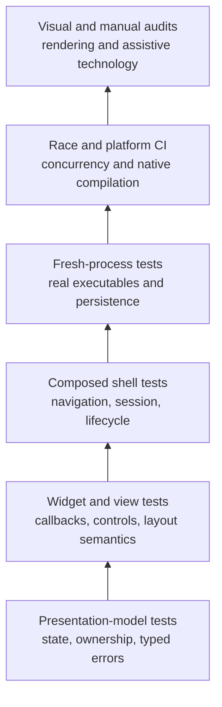
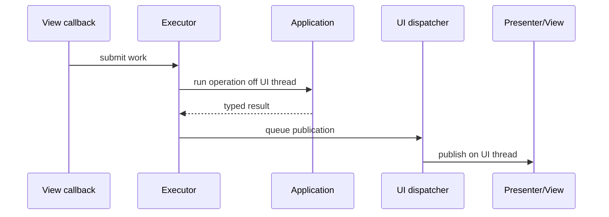

<!-- Generated from https://thefellow.github.io/articles/testing-native-go-desktop-applications-headlessly/ by scripts/generate_llm_content.py; do not edit. -->

# Testing Native Go Desktop Applications Headlessly

Source: [https://thefellow.github.io/articles/testing-native-go-desktop-applications-headlessly/](https://thefellow.github.io/articles/testing-native-go-desktop-applications-headlessly/)

## Pyramid summary

- **~2 words:** Headless desktop
- **~8 words:** Layered evidence for native GUI behavior without opening windows.
- **Expanded:** A layered testing strategy for Fyne applications, from deterministic presentation models and virtual widgets through composed lifecycles, fresh processes, race tests, and visual evidence.

## Full content

**Part 9 of [Building Mixology](/series/mixology.md).**

Native desktop behavior does not begin at the pixels. It begins with state ownership, callbacks, asynchronous work, framework controls, composition, and lifecycle. Most of that behavior can be tested without a display server if the application exposes the right seams.

Mixology's Fyne client runs headlessly in ordinary Go tests. Its tests construct presentation models with deterministic executors, create real Fyne widgets through the framework's in-memory application, drive semantic controls, navigate the composed shell, open a real temporary database, invoke the CLI as a subprocess, and run the same packages under Go's race detector.

The useful result is not one large simulated UI test. It is a ladder of evidence in which each layer owns a different failure mode.

## The evidence ladder



The lower layers are fast and precise. The upper layers cover more integration but provide less local failure information. A desktop feature is well supported when its important behavior appears at the lowest layer that can observe it, with a smaller number of composed tests proving that the layers are wired together.

This avoids two common traps. Widget-only tests make asynchronous policy difficult to control. End-to-end-only tests turn every failure into a search across the whole application.

## Keep presentation state independent of the window

Each Mixology domain GUI owns a presenter with typed state. It knows whether a load is active, which entity is selected, which form instance is open, which action is available, and which typed error should be shown. The Fyne view subscribes to snapshots and translates them into controls.

That division lets a test exercise the hard interaction rules without creating a native window:

```go
executor := &fynetest.ManualExecutor{}
dispatcher := &fynetest.ManualDispatcher{}
presenter := NewPresenter(session, Dependencies{
    Executor:   executor,
    Dispatcher: dispatcher,
    Dialogs:    &fynetest.Dialogs{},
})

presenter.Refresh()
presenter.SetFilter("first")
presenter.Refresh()

executor.Run(1) // Newer work completes first.
dispatcher.RunNext()
executor.Run(0) // Older work completes later.
dispatcher.RunNext()

snapshot := presenter.Snapshot()
// Assert that the older result did not replace the current state.
```

The exact helper names vary by package, but the seam is stable: production chooses asynchronous execution and UI-thread dispatch, while tests choose when work runs and when publication occurs.

This distinction matters because completion order and publication order are separate. Work A can finish before work B, yet A's queued UI callback can run after B's. Mixology's latest-request helper checks its generation when publication executes, not only when background work completes. Tests control both queues so that stale-result behavior is demonstrated rather than inferred.

Presentation-model tests cover:

- loading, success, empty, and typed failure states;
- filter and selection transitions;
- validation and correctable form state;
- request-generation invalidation;
- duplicate-submission guards;
- captured mutation targets;
- form-instance identity;
- authorization failures and action availability.

These tests are ordinary Go tests. They are quick enough to enumerate state transitions and deliberate timing permutations that would be awkward to reproduce by clicking a window.

## Inject execution and publication separately

Desktop work has two directions. Application operations leave the UI goroutine, then their results return to it.



Mixology models those directions as small interfaces. An executor starts background application work. A dispatcher publishes changes through Fyne's UI goroutine. Production uses a managed executor and a Fyne dispatcher. Tests use inline or manually controlled implementations.

Keeping the seams separate provides several test modes:

- Inline execution plus inline dispatch gives a concise synchronous feature test.
- Manual execution plus inline dispatch controls completion order.
- Manual execution plus manual dispatch controls completion and UI publication independently.
- Asynchronous execution plus the production dispatcher supports composed concurrency tests.

The managed production executor also owns shutdown. Closing it rejects new work and waits for accepted operations to finish. A gated dispatcher prevents queued publications from entering a closing UI. Tests hold work in flight, close the desktop, release the work, and assert that shutdown completes without publishing into a dead window.

## Construct real Fyne controls without a display

Fyne's [`test`](https://pkg.go.dev/fyne.io/fyne/v2/test) package supplies an in-memory application, windows, canvases, input helpers, and rendering support. A typical view test has three parts:

```go
app := test.NewApp()
defer app.Quit()

view := NewView(presenter)
driver := fynetest.NewDriver(t, view.Content())

driver.Tap("create-drink")
driver.Type("drink-name", "Boulevardier")
driver.Tap("save-drink")
```

`pkg/testutil/fynetest` is Mixology's application-level driver. It finds controls by semantic identifiers and performs actions through their real callbacks. The identifiers describe intent, such as `save-drink`, rather than a position in a container tree.

That level verifies behavior a presenter cannot see by itself:

- a button invokes the intended command;
- an entry sends edits to the correct form instance;
- a selector carries a typed identity while displaying a name;
- disabling an action prevents its callback;
- table-cell recycling replaces old text, tags, and action handlers;
- scrolling over a field continues to move the containing form;
- dialog confirmation preserves the target captured when it opened;
- token editors normalize, replace, and remove canonical tags.

Real controls are worth using here. A fake button can prove that a callback function exists, but it cannot expose a stale callback left on a recycled Fyne table cell or a widget disabled visually but still wired incorrectly.

## Make controls semantic

Container position is a brittle test API. Adding a label can turn `children[2]` from Save into Cancel without changing the product's behavior. Text is also an incomplete identifier because labels can repeat, change with state, or be localized.

Mixology's shared GUI toolkit provides semantic buttons, entries, selectors, and guarded commands. The headless driver searches for those semantics in the real widget tree. Tests say what the person is doing rather than how the current layout happens to be nested.

There is a design benefit beyond testing. Semantic controls create one place to enforce enabled behavior, keyboard commands, icons, and action identifiers. A button and a menu shortcut can invoke the same guarded command, so tests verify the command once and the framework wiring at the view boundary.

The test helper should remain thin. It may locate a semantic control and invoke Fyne's normal test action, but it should not duplicate the presenter's validation or mutate application state directly. Otherwise a passing test can describe the helper rather than the application.

## Replace native dialogs at the boundary

Confirmation and error dialogs involve platform windows and human decisions. Presentation tests need their outcomes, not an operating-system dialog loop.

Mixology injects a small dialog boundary. The production implementation presents Fyne dialogs. The test implementation records requests and lets the test confirm, cancel, or inspect the error deliberately.

```go
dialogs := &fynetest.Dialogs{}
presenter := NewPresenter(session, Dependencies{Dialogs: dialogs})

presenter.DeleteSelected()
dialogs.Confirmations()[0].Respond(true)

// Assert the public delete operation and resulting presentation state.
```

The boundary should preserve meaningful data: title, message, target identity, confirmation callback, and error. A single `AlwaysConfirm` boolean is convenient but cannot test cancellation, multiple pending dialogs, or target capture when selection changes before confirmation.

## Test the composed shell

Domain view tests establish individual workflows. Shell tests establish that the desktop application actually composes them.

Mixology opens Fyne's in-memory application with a real application session and temporary bstore database. The tests inspect authorized routes, navigate workspaces, drive concrete content, and close the desktop. They verify that:

- every readable workspace is mounted;
- denied routes and dashboard cards are absent;
- navigation preserves or refreshes view state according to shell policy;
- all domain presenters share the intended application session;
- close is idempotent;
- persistence ownership is released after the window closes;
- background work is drained before application resources are closed.

These are not exhaustive domain tests. A shell test should not repeat every validation case already covered by a presenter. It proves construction and lifecycle, where wiring failures live.

Use a temporary path for every database-backed test and close every application explicitly. Desktop tests are long-lived by nature, so leaked stores, applications, or goroutines can make later tests fail in ways that hide the original owner.

## Cross a real process for cross-surface claims

An in-process fixture can prove that the GUI calls a public module. It cannot prove that another executable uses the same flags, database path, composition root, and commit lifecycle.

Mixology's cross-surface tests build the actual CLI binary, execute it against a temporary database, then start a fresh GUI lifecycle on that database. They also mutate through concrete GUI controls, close the GUI, and inspect the persisted state through a fresh CLI process.

This layer catches:

- a command wired to the wrong database path;
- argument parsing that never reaches the intended operation;
- commits deferred until a lifecycle that the process does not run;
- a surface using private or alternative persistence behavior;
- a desktop close path that retains the database lock;
- discrepancies between the documented parity matrix and composed clients.

Keep these tests fewer and broader than presenter tests. Process startup and binary builds cost more, and a failure spans more components. Their purpose is boundary evidence, not combinatorial coverage.

## Deliberately test adversarial time

Retained-mode applications fail in sequences that synchronous happy paths suppress. Useful headless tests choose hostile orderings:

1. Start two loads, complete the second, then complete the first.
2. Complete background work in order, but publish its UI callbacks in reverse order.
3. Open a form, type into a live widget, then publish an unrelated refresh.
4. Cancel a form and reopen an equal-valued form with a new instance identity.
5. Open a confirmation, change selection, then confirm the original action.
6. Begin shutdown while accepted work is blocked, then release it.
7. Attempt a second mutation while the first submission owns the workflow.

Manual executors and dispatchers make these sequences deterministic. Channels and gates are useful for the composed shutdown cases where real goroutines are part of the contract. Fixed sleeps are not synchronization; they make timing failures intermittent and slower.

## Run the race detector and compile on every target

Deterministic tests demonstrate the ownership protocol, but they do not enumerate every goroutine interleaving. Mixology also runs the Fyne packages with Go's race detector. The two techniques complement each other: controlled queues state which completion should win, while the race detector finds unsynchronized memory access.

Native desktop code also has a compilation boundary. Linux CI needs the development libraries Fyne uses for OpenGL, Wayland, keyboard, and X11 integration. macOS, Windows, and Linux jobs compile and package their target-native applications. Headless widget tests can pass while a platform build fails, so both belong in the verification matrix.

A practical CI sequence is:

```text
unit and presenter tests
    -> headless widget and shell tests
    -> race-enabled GUI tests
    -> target-native build and packaging
```

Run inexpensive tests first for useful feedback, but keep platform compilation as required evidence for a native client.

## Pixels and assistive technology remain distinct evidence

Headless tests can render fixed-size canvases and compare or inspect visual states. Mixology uses stable window sizes and the in-memory driver to cover dashboards, tables, details, forms, menus, tags, audit, and empty collections. This catches clipping, missing content, and unintended layout changes that semantic interaction tests may not notice.

Pixel evidence has limits. Font rasterization, theme changes, graphics drivers, and platform widgets can make exact screenshots noisy. Prefer a small set of purposeful visual states. Keep behavioral assertions in semantic tests, where a color or antialiasing change cannot hide the real contract.

Assistive technology requires another boundary. Automated tests can prove that keyboard commands are guarded, focusable controls exist, and semantic labels are present. They do not establish the experience in VoiceOver, Narrator, Orca, high contrast, or scaled displays. Record those as manual platform audits with repeatable steps and results.

Headless does not mean complete. It means that most application behavior no longer depends on a person watching a window.

## A feature-level checklist

For a new desktop workflow, I look for evidence in this order:

- The presenter covers loading, empty, success, validation, typed errors, authorization, and timing ownership.
- The view test drives real controls through semantic identifiers.
- Dialog outcomes are controlled without bypassing the presenter.
- The composed shell can navigate to the workflow for an authorized persona and omits it when unreadable.
- At least one persisted path crosses a fresh lifecycle, and important cross-surface claims cross a real process.
- Concurrency-sensitive packages pass under `go test -race`.
- Target-native CI compiles the application.
- Selected visual states and manual accessibility protocols cover what semantic tests cannot observe.

This checklist is intentionally layered. A denied Save belongs in a presenter test. A missing Save button belongs in a view test. A missing workspace belongs in a shell test. A wrong database path belongs in a process test. A platform linker failure belongs in target-native CI.

## The result

Mixology's desktop tests are effective because the application was shaped to expose ownership. Presentation models can run without windows. Execution and UI publication can be controlled independently. Real Fyne widgets can be constructed in memory. Dialogs, shell lifecycle, persistence, subprocesses, and concurrency each have a deliberate test boundary.

The result is a native GUI whose important behavior can be reproduced by `go test`: stale work loses deterministically, live input survives unrelated publication, restricted actions stay unavailable, callbacks target the intended entity, shutdown drains accepted work, and independently composed clients observe the same persisted application state.

The remaining visual and assistive-technology checks are clearer because the behavioral work is already covered. A manual audit can concentrate on what only a platform and a person can observe.
