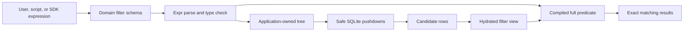
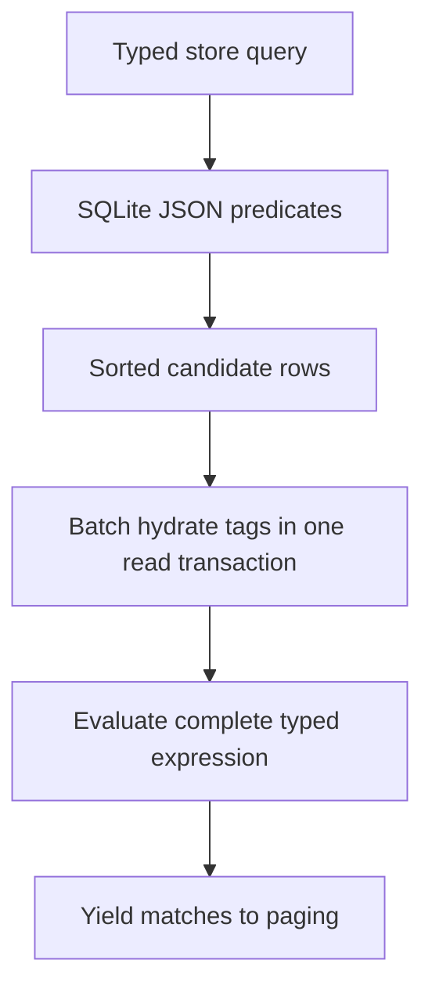

<!-- Generated from https://thefellow.github.io/articles/typed-filtering-over-sqlite/ by scripts/generate_llm_content.py; do not edit. -->

# Typed Filtering over SQLite

Source: [https://thefellow.github.io/articles/typed-filtering-over-sqlite/](https://thefellow.github.io/articles/typed-filtering-over-sqlite/)

## Pyramid summary

- **~2 words:** Typed filters
- **~8 words:** How typed expressions become safe, exact SQLite query plans.
- **Expanded:** How Mixology gives people and programs one typed filter language, then translates its safe subset into SQLite while retaining exact application semantics.

## Full content

**Part 11 of [Building Mixology](/series/mixology.md).**

[Mixology](https://github.com/TheFellow/go-modular-monolith) originally had the usual collection of list parameters: exact name, category, status, time bounds, and a few domain-specific switches. Those parameters remain useful for common workflows, but they do not compose into questions such as:

```text
category == "cocktail" && (name.contains("gin") || tags contains "featured")
```

I wanted one filtering model that was natural at a prompt, stable in a script, discoverable without reading Go, and reusable by an SDK or another presentation surface. The result is a typed expression contract built with [Expr](https://expr-lang.org/) and a deliberately SQLite-aware execution path.

The first version of this work targeted bstore. Mixology has since [moved its embedded persistence boundary to SQLite](/articles/migrating-mixology-from-bstore-to-sqlite.md). That migration changed the query adapter and its pushdowns, but it did not change the expression language callers use or the rule that the complete expression remains the semantic authority.

## Keep the public language above persistence

Every filterable domain list request accepts a `Filter` string. The CLI exposes it as `--filter`, the TUI and GUI preserve the same expression in their list state, and callers of the Go modules can construct the same request directly. A single expression travels across these boundaries without turning the public API into a database query builder.

```text
status == "pending" && created_at >= date("2026-08-01T00:00:00Z")
quantity < 5 || tags contains "reorder"
principal.id == "manager" && success
```

Mixology does not expose all of Expr. Arithmetic, arbitrary function calls, and dynamic constructs are rejected. The accepted language is intentionally small enough to document, validate, format canonically, and translate safely. `date` and `duration` require literal arguments, and regular expressions are compiled during parsing. Misspelled fields, incompatible comparisons, malformed dates, and invalid patterns fail before a query executes.

Each domain owns the fields that make sense for its list. Inventory, for example, defines a typed view specifically for filtering:

```go
type ListFilterView struct {
    ID           string    `expr:"id" filter:"Inventory ID" filter-column:"InventoryID"`
    IngredientID string    `expr:"ingredient_id" filter:"Ingredient ID" filter-column:"IngredientID"`
    Quantity     float64   `expr:"quantity" filter:"Quantity on hand" filter-column:"Quantity"`
    Unit         string    `expr:"unit" filter:"Measurement unit" filter-column:"Unit"`
    LastUpdated  time.Time `expr:"last_updated" filter:"Last update timestamp" filter-column:"LastUpdated"`
    Tags         []string  `expr:"tags" filter:"Tags (key or key=value)"`
}
```

The `expr` tag names the public field, `filter` describes it to a user, and `filter-column` explicitly maps a persisted field into SQLite pushdown. Tags have no column mapping because they are loaded from the shared tagging subsystem after the primary rows are selected.

The filtering view is not necessarily the stored row or the returned domain model. Drinks can expose `recipe.garnish`; Audit can present complete Cedar entity UIDs assembled from stored type and ID fields; every taggable domain can expose its hydrated tag strings. The application chooses a useful query vocabulary instead of publishing its storage layout by accident.

## Borrow a compiler, own the contract

Expr provides the parser, type checker, and virtual machine. Mixology compiles against each domain's concrete view, turns the checked syntax into an application-owned tree, and retains the original source, canonical text, typed schema, and compiled program.

The compile call deliberately includes `expr.Optimize(false)`. Mixology derives its canonical form and owned tree from Expr's checked AST, so allowing Expr to fold or rearrange that AST would also let a dependency's optimizer redefine the structure used for public formatting and SQL planning. Disabling that optimization preserves the expression the application accepted. Mixology's own restricted syntax, AST patches, `Node` conversion, and pushdown planner then decide which transformations are valid for this contract.

```go
type Node struct {
    Kind     Kind
    Name     string
    Operator string
    Value    any
    Children []Node
}
```

Those representations serve different jobs. The canonical form gives logs, saved filters, tests, and future SDKs a stable spelling. The application-owned tree supports planning without coupling persistence code to Expr internals or inheriting Expr optimizer behavior. The compiled program evaluates the complete predicate against a typed view.



The filtering contract therefore survived a complete storage replacement. Its ownership sits in the public schema, checked syntax, canonical form, error behavior, and final evaluation, not in the name of a query library.

## Push down only what remains true

The store's typed query API supports equality, inequality, range, membership, ordering, and residual predicates. `ApplySQLPushdowns` walks the checked tree and adds only constraints implied by the complete expression.

For this expression:

```text
category == "spirit" && (name.contains("gin") || tags contains "featured")
```

`category == "spirit"` is a safe pushdown. Every row satisfying the complete expression must satisfy that conjunct, and `Category` is an explicitly mapped persisted field. The nested `or` cannot be narrowed to either branch. Selecting only gin names or only featured tags would discard valid results, and tags are not present on the primary row.

The planner descends through Boolean groups, translates checked comparisons with literal values, reverses comparisons when the field appears on the right, and recognizes safe equality sets across compatible `or` branches. It does not push a constraint merely because one branch mentions a mapped field.

SQLite applies those predicates through `json_extract` expressions over the store's JSON records. Time fields use Julian-day comparisons, and registered `store` tags create matching expression indexes and unique constraints. After candidate selection, Mixology still evaluates the complete compiled expression. Pushdowns reduce work; they never redefine the answer.

## Hydrate before exact evaluation

Audit fields can be projected completely from one `AuditEntryRow`. `ApplySQL` adds safe native constraints and installs a residual `FilterFn` that projects each candidate row and evaluates the full expression.

Tags require a staged path. Drinks, Ingredients, Inventory, Menus, and Orders first call `ApplySQLPushdowns`, sort and load candidate rows, then fetch their tags within the same read transaction. Each row and its tags become the domain's complete filter view before `Expression.Match` decides whether paging can yield it.



Filtering remains part of the application list operation, not a CLI post-processing step. Cursor paging counts matching authorized items rather than fetching a page and removing rows afterward. Authorization still wraps the query, so a filter can narrow what a principal asks for but cannot widen what that principal may read.

Tests cover the boundaries where meaning could be lost: aliases round-trip to one canonical spelling, unknown constructs fail, invalid literals fail during parsing, unsafe `or` expressions do not narrow candidates, date comparisons reach SQLite, tag predicates run after hydration, and filtered paging continues across enough stored rows to reveal post-page filtering mistakes.

## Let concrete execution remain concrete

The .NET Mixology port consumes the published [Expr for .NET](/projects/expr-dotnet.md) 0.1.0 package and applies the same division with EF Core. Its planner emits an `Expression<Func<TRow, bool>>` for safe constraints, hydrates fields such as tags, then evaluates the complete Expr program against the public view. The mechanisms differ, but the correctness rule is the same.

This is also a downstream validation of the package boundary. `Mixology.Filtering` exercises the public checker, immutable AST, compatibility rewriting, canonical printer, and exact VM evaluation, then its [SQLite tests](https://github.com/TheFellow/modular-monolith/blob/master/tests/Mixology.Filtering.Tests/SqlitePushdownTests.cs) compare optimized candidate selection with the complete expression result. The application uses the same NuGet artifact that Expr's own upstream traceability, differential corpus, focused tests, fuzz gate, and Native AOT sample validate before release.

The Go implementation now demonstrates that boundary across two persistence generations. bstore shaped the first adapter. SQLite shapes the current one through SQL predicates, JSON expressions, registered indexes, and WAL-backed transactions. The public filtering language did not need to pretend those databases were interchangeable. It needed to own the semantics that should survive when they were not.
