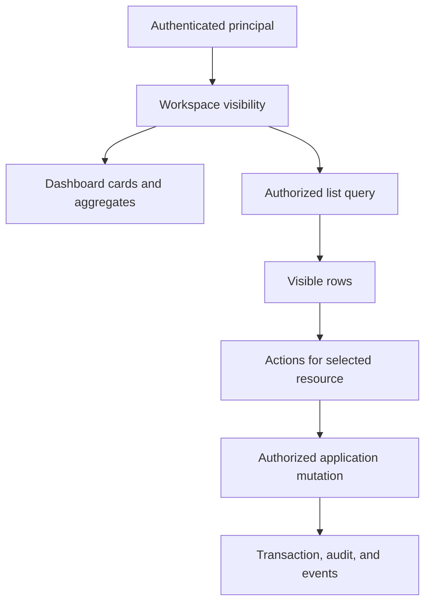
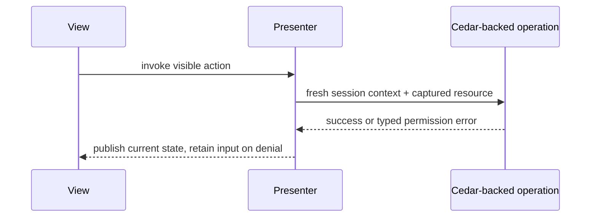

<!-- Generated from https://thefellow.github.io/guides/authorization-is-part-of-navigation/ by scripts/generate_llm_content.py; do not edit. -->

# Authorization Is Part of Navigation

Source: [https://thefellow.github.io/guides/authorization-is-part-of-navigation/](https://thefellow.github.io/guides/authorization-is-part-of-navigation/)

## Pyramid summary

- **~2 words:** Authorized navigation
- **~8 words:** How Cedar shapes routes, aggregates, rows, and available actions.
- **Expanded:** How Mixology carries Cedar authorization through workspace discovery, dashboard summaries, row filtering, and action availability without turning the interface into a second policy engine.

## Full content

Authorization becomes visible long before someone presses Save. It determines which workspaces exist in navigation, which summary cards appear on a dashboard, which rows enter a list, and which actions make sense for the selected entity. Treating only the final command as protected leaves the application technically resistant to mutation while its interface still discloses names, counts, relationships, and capabilities.

The Fyne surface added to [Mixology](https://github.com/TheFellow/go-modular-monolith) forced this issue into the open. A persistent desktop shell advertises the shape of the application continuously. Its dashboard summarizes several domains at once. Its tables expose row actions. The GUI could not rely on a permission error at the end of a workflow and still present a coherent experience.

The resulting rule is simple: policy remains in Cedar and the application boundary, while each presentation surface composes only the experience the active principal is allowed to use.

## One decision appears at several scales

A useful way to reason about authorization in an application surface is to follow it from the outside inward:



Each layer answers a different question.

- Workspace visibility asks whether the principal has a meaningful read path into a domain.
- Dashboard composition asks whether even the existence or count of that domain may be disclosed.
- A list query decides which resources the principal can observe.
- Action availability evaluates a concrete resource, including its attributes and relationships.
- The operation authorizes again inside the application pipeline before changing state.

These are not duplicate implementations of policy. They are multiple consumers of the same policy at points where the interface needs to make a decision. The final operation remains authoritative because interface state can be stale, bypassed, or raced.

## Build navigation from authorized read paths

Mixology's desktop composition begins with all known workspaces, then asks each domain's action projector for its collection capability. The shell reads the same stable control IDs that the GUI and TUI adapters consume, such as `drinks.list`, `audit.list`, and `tagging.summary`. It no longer infers navigation from count queries or performs its own direct Cedar calls.

That distinction matters for entity-filtered catalogs. Drinks, Ingredients, Inventory, Menus, and Orders do not have a real collection entity in the policy model. Their list controls are public presentation capabilities because Cedar authorizes and elides each returned row inside the query pipeline. Projecting a synthetic collection resource would invent policy meaning that the application does not have. Audit list and Tag summary do have explicit authorization resources, so their projectors evaluate those genuine capabilities.

The distinction between denial and failure matters. A Cedar permission error removes the workspace. An operational projection error leaves it visible so that the surface can present the real problem. Hiding every failed projection would misreport an outage as a policy decision and make a broken domain silently disappear.

After projection, the shell is constructed from the filtered route collection. A restricted route is therefore absent from the navigation rail, application menu, keyboard shortcut registration, route lookup, and lazy view construction. It is not merely a hidden button pointing at an otherwise reachable screen.

```go
if err := check.read(); err == nil || !apperrors.IsPermission(err) {
    visible[check.id] = true
}
```

This is composition, not enforcement. A public collection capability still returns only rows authorized by the query pipeline, and an attempted mutation still authorizes at the application boundary. Composition makes the shell truthful without converting navigation into a second policy model.

## Aggregates can leak what rows conceal

A dashboard count is data. If a sommelier is allowed to see only wine drinks and drinks tagged for that audience, an unfiltered total still reveals that other drinks exist. Low-stock totals, pending-order counts, recent audit activity, and published-menu counts can reveal business state even when no row is named.

Mixology handles this at two levels. First, the desktop dashboard receives the same workspace visibility map as the shell and omits cards for unauthorized workspaces. A principal who cannot read Audit or summarize Tags does not receive a teaser card for either feature. Second, dashboard values are loaded through the application session rather than by reading DAOs from the GUI. The application owns how counts and recent activity are derived, so the presentation cannot accidentally bypass row policy for convenience.

Unknown data also deserves an explicit representation. A failed or partial dashboard load should not substitute zero, because zero is a factual claim. Mixology uses unknown dashboard values and presents the error beside any data that could be loaded. That separates three states which have different security and operational meaning: authorized and empty, unauthorized and omitted, or unavailable and unknown.

When adding an aggregate, I now ask the same questions I ask for a list:

1. Which principal and action authorize this observation?
2. Does the aggregate include only resources that principal may observe?
3. Can the label, zero state, or error reveal a restricted domain?
4. Does a partial failure remain distinguishable from a legitimate count?

## Let authorized queries filter rows

Route access does not imply access to every entity in a workspace. The sommelier example makes that concrete: the Drinks workspace remains useful, but Cedar filters its result to wines and explicitly tagged drinks. The surface calls the public list operation and renders the returned page. It does not fetch every row and reproduce Cedar conditions in GUI code.

Filtering below the surface has several benefits. Pagination counts the records the caller can actually traverse. Selectors used by recipes, menus, and order placement do not fill with inaccessible entities. CLI, TUI, and GUI observe the same resource boundary. Policy changes remain policy changes instead of requiring coordinated edits to three presentations.

This also prevents a common side channel. Client-side filtering may hide row text after IDs, totals, page counts, or loading behavior have already disclosed the hidden records. Returning an authorized result set from the application boundary gives the surface less sensitive material to mishandle.

## Availability belongs to the selected resource

Mutation permissions are often more specific than roles. A pending order can be completed while a completed order cannot. A draft menu can accept drinks and be published, while a published menu can be returned to draft. Cedar can also consider tags and resource relationships. The interface therefore needs action availability for the actual selected row, not a single `isManager` flag computed at login.

Each Mixology domain exposes an `ActionProjector` beside its public module and stable, namespaced control IDs. Drinks, Ingredients, Inventory, Menus, Orders, Audit, and Tagging define the complete capability vocabulary their surfaces consume. The projectors accept a shared `authz.EntityAuthorizer` function boundary, which keeps them usable with the in-process Cedar policy set while leaving room for an adapted remote policy service. A framework-neutral evaluator turns their declarations into `Visible`, `Enabled`, and `DisabledReason` state. Views translate the result into native presentation behavior: denied controls disappear, authorized controls with unmet prerequisites remain visible but disabled, and detail action bars change with selection and lifecycle state.

Menus demonstrates why separating permission from availability matters. Edit supplies the broad permission default, while Publish uses its own Cedar action instead of accidentally inheriting Edit. A draft that is authorized for publication but not yet publishable keeps Publish visible and records the missing prerequisite. The GUI maps that state into visible and enabled controls; the TUI maps it into key availability, help, and explanatory detail text. Both consume the same domain projection without sharing widget code.

Tagging makes domain ownership especially important. It can inspect or mutate targets owned by several other domains, but it does not guess their Cedar action names. Its projector resolves the target type through Tagging's registry and uses the owning domain's registered Get, Tag, and Untag actions against the complete target entity.

The declaration contains only durable facts that should agree across surfaces. Dirty input, a confirmation dialog, focus, paging, filtering, and an in-flight request remain in the concrete adapter. This keeps the common model small: domains own the meaning of an action, the evaluator owns permission and condition semantics, and each runtime owns its interaction state.

Projected state has a lifetime. Selection changes clear the previous result. Refreshing a row recomputes it. Starting asynchronous work captures the target so a later selection cannot inherit the result. If projection fails, the presenter clears capability state without erasing an unrelated load error, then recovers on a later successful refresh. A stale Delete state from the previous drink is both a usability bug and a dangerous statement about authority.

## Denial is still an ordinary application result

Preflight authorization improves composition, but it never replaces authorization at execution. State may change after a button appears. Another operation may change a resource attribute used by Cedar. A caller may invoke the public module without any interface at all.

Every mutation therefore enters the normal application pipeline and can return a typed permission error. GUI presenters treat that error as recoverable presentation state. They retain correctable input, leave persisted state unchanged, and show the denial consistently with other typed application errors. Tests exercise this path even for controls that should normally be unavailable, proving that the boundary holds when presentation assumptions are bypassed.



This is the useful separation of responsibilities. Cedar decides permission. Domain state supplies durable prerequisites. The shared evaluator gives every surface the same interpretation. The application command enforces both again and returns typed results. The view renders the projection using its runtime's native controls.

## Test the absence as well as the success

Authorization tests should observe the complete presentation boundary. Mixology's composed desktop tests start sessions for restricted personas and assert the route IDs offered by the real shell. They verify that hidden routes cannot be navigated to, that dashboard cards follow the same visibility set, and that visible workspaces still expose only authorized rows and actions. Presenter tests compare an owner with a read-only actor and inspect capability state for concrete resources. Mutation tests force permission failures and prove that no state changed.

The useful assertions include negative space:

- The route, menu item, shortcut, and dashboard card are all absent.
- Restricted rows do not affect visible totals or selectors.
- Row and detail actions disappear when their Cedar action is denied.
- Changing selection cannot retain an earlier resource's capabilities.
- A direct or stale invocation is denied by the application operation.
- The denial does not discard form input or partially mutate persisted state.

This ladder catches different failures. A policy unit test can prove a Cedar rule, but not that a dashboard leaks a count. A view test can prove a button is hidden, but not that the operation rejects a bypass. Both are required because authorization shapes both information and behavior.

## Authorization is a composition input

The desktop work changed how I describe authorization in a modular application. It is not only middleware around commands, and it is not a collection of role checks scattered through widgets. It is an input to application composition.

Routes come from authorized read paths. Dashboard summaries follow the same information boundary as their workspaces. Lists return only observable resources. Presenters derive actions from Cedar-backed decisions about concrete entities. Operations authorize again when work executes. Keeping those layers aligned gives each surface an interface that is useful, truthful, and resistant to bypass without asking the interface to become the policy engine.
