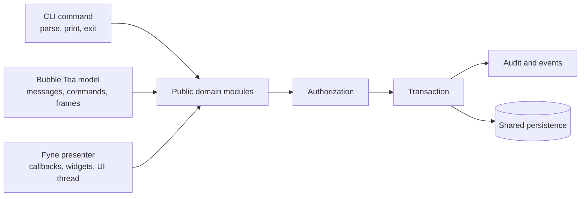
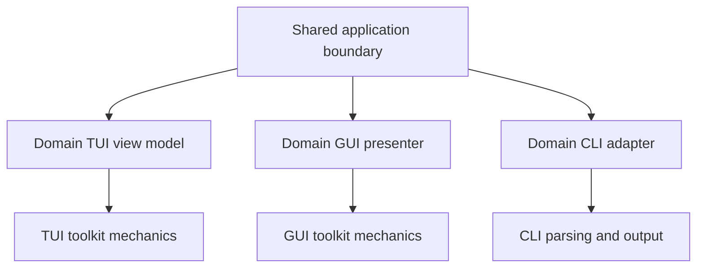

<!-- Generated from https://thefellow.github.io/guides/bespoke-views-over-a-shared-application-boundary/ by scripts/generate_llm_content.py; do not edit. -->

# Bespoke Views over a Shared Application Boundary

Source: [https://thefellow.github.io/guides/bespoke-views-over-a-shared-application-boundary/](https://thefellow.github.io/guides/bespoke-views-over-a-shared-application-boundary/)

## Pyramid summary

- **~2 words:** Bespoke surfaces
- **~8 words:** Why native views share application behavior, not universal view models.
- **Expanded:** What Mixology shares across CLI, Bubble Tea, and Fyne, and why each surface keeps a presentation model shaped for its own runtime instead of adopting a universal view model.

## Full content

[Mixology](https://github.com/TheFellow/go-modular-monolith) now presents the same modular application through a command-line interface, a persistent Bubble Tea terminal interface, and a retained-mode Fyne desktop interface. Adding the third surface made one boundary especially clear: the durable reuse is the application behavior behind the views, not a view model stretched across every presentation technology.

All three surfaces can place an order, publish a menu, edit a recipe, adjust inventory, attach tags, and observe audit history. They do not need to represent those workflows with the same state machine. A CLI command parses one invocation and exits. A Bubble Tea model consumes messages and renders text frames. A Fyne presenter coordinates callbacks, retained widgets, dialogs, and publication onto a UI thread. Making those runtimes share a universal view model would preserve identical method names by discarding the concepts that make each one understandable.

Mixology instead shares an application boundary and gives each adapter permission to be itself.

## Share the behavior that must remain equal

Every Mixology operation enters an exported domain module through a fresh middleware context. The persistent TUI and GUI bind the authenticated principal in an application session, while the CLI creates its context for one invocation. That path owns authorization, transaction scope, audit recording, and event publication. Public models, identifiers, filters, tags, requests, results, and typed errors cross the boundary, and fresh operation state prevents middleware attributes from leaking between interactions.

That center is the contract worth defending. When one surface creates a drink and another reads it, they agree because both used the same application operation and persisted model. They do not agree because their text fields inherited from the same base class.

This distinction also gives cross-surface tests a precise purpose. Mixology builds the real CLI, runs it against a temporary database, opens a GUI or TUI session on the same data, and observes the result through that surface. The reverse path writes through a persistent interface and reads through a fresh CLI process. The evidence is shared application behavior, including parsing, composition, authorization, commit, and process lifecycle.

## Each runtime has a different unit of interaction

The CLI's natural unit is an invocation. Flags and positional arguments become a typed request, the command calls a public module, output is written, and the process exits. There is no durable selection, focus owner, dirty form, late publication, or back stack to model.

Bubble Tea's natural unit is a message. A domain view model implements `Init`, `Update`, and `View`, returns commands for asynchronous work, reports contextual help, and declares whether its current interaction captures text or handles Back. Forms distinguish selection from editing because terminal keys flow through one event loop. A workflow mode decides which child model owns the next message.

Fyne's natural unit is a retained object and callback. Widgets remain alive while data changes around them. A presenter publishes snapshots that a view translates onto the UI thread. Dialog completion arrives through callbacks. A text entry can contain newer input than the last presenter snapshot. Request generations reject stale loads, submission ownership prevents overlapping mutations, and form-instance identity distinguishes two workflows containing equal values.

These are not cosmetic variations over one protocol. They are correctness mechanisms imposed by each runtime.

| Concern | CLI | Bubble Tea TUI | Fyne GUI |
| --- | --- | --- | --- |
| Lifetime | One command | Persistent model | Retained widget tree |
| Input | Parsed arguments | Typed messages and keys | Callbacks, focus, bindings |
| Async result | Command completion | `tea.Msg` | Executor plus UI dispatcher |
| Navigation | Command hierarchy | Route and back stack | Shell routes, menus, shortcuts |
| Local editing | Request construction | Explicit workflow modes | Live widgets plus presenter forms |
| Output | Text or structured stream | Rendered terminal frame | Native controls and dialogs |

A universal model must either expose all of these concepts to every adapter or reduce them to a least-common-denominator protocol. The first choice couples each surface to irrelevant runtime concerns. The second hides important ownership behind generic callbacks and maps.

## The least common denominator is not neutral

It is tempting to define a framework-independent interface such as `Load`, `Select`, `Submit`, and `State`, then adapt each presentation to it. The names look portable, but their semantics are not.

What does `Select` mean for a CLI command that receives an ID once? Does `State` include a Bubble Tea spinner command, Fyne dialog ownership, terminal help bindings, native focus, or a stream of publications? Is cancellation a process signal, Escape in a nested form, closing a dialog, invalidating a load generation, or waiting for accepted desktop work during shutdown?

Removing those details from the interface does not remove them from the software. It pushes them into adapters that now coordinate a generic model and their runtime through parallel state. The adapter becomes the real view model, while the shared object adds another protocol to synchronize.

The opposite approach, putting every concern into the common model, produces framework-shaped conditionals. A model starts carrying terminal widths, widget visibility, CLI formatting, dispatcher hooks, and callbacks that only one consumer understands. Sharing becomes a dependency from every surface to the union of all surfaces.

Mixology avoids both outcomes. Its TUI view models live below each domain's `surfaces/tui` package and use the Bubble Tea toolkit. GUI presenters live below `surfaces/gui` and use the GUI toolkit. CLI adapters own parsing and output. Architecture rules prevent one presentation surface from importing another or reaching into a domain's private DAO and command implementations.

## Reuse mechanics within a surface

Rejecting a universal view model does not mean duplicating every screen. Mixology has two narrower kinds of presentation reuse.

The first is runtime-specific mechanics. [`pkg/toolkits/tui`](https://github.com/TheFellow/go-modular-monolith/blob/main/pkg/toolkits/tui/readme.md) owns searchable list/detail composition, forms, dialogs, spinners, layout, and test drivers in Bubble Tea terms. [`pkg/toolkits/gui`](https://github.com/TheFellow/go-modular-monolith/blob/main/pkg/toolkits/gui/readme.md) owns a Fyne shell, standard list/detail and form layouts, semantic controls, tables, dialogs, executors, dispatchers, and deterministic presentation test seams. The smaller [`pkg/toolkits/cli`](https://github.com/TheFellow/go-modular-monolith/blob/main/pkg/toolkits/cli/readme.md) standardizes JSON input and output plus human-readable rendering. These packages know their presentation technology but not Drinks, Menus, or Orders.

The second is application-wide presentation vocabulary. A shell can establish navigation, identity, status, and lifecycle for its surface. Shared keys or tag editors can encode Mixology conventions used by several domains. Those components may know the application, but they still belong to one runtime.

Domain surfaces supply the remaining meaning. Drinks owns recipe rows and substitute selection. Menus owns drink curation, publication, and cost analysis. Orders owns placement, completion, and cancellation. Audit remains read-only. A standard list/detail layout can arrange these workflows without claiming they are one generic CRUD screen.

Abstractions are earned horizontally within a runtime, after several domains demonstrate the same mechanic. Behavior is shared vertically through the public domain module. This keeps reuse aligned with the reason the code is actually alike.

The repository's [domain-surface guide](https://github.com/TheFellow/go-modular-monolith/blob/main/app/domains/readme.md#presentation-surfaces) names the ownership boundary, and each executable now keeps its composition and onboarding notes beside the entrypoint. Those short paths turn the architectural claim into a trace a new contributor can follow directly through the packages.

## Bespoke state makes ownership visible

The GUI work exposed several cases where runtime-specific state was necessary for correctness.

A retained widget may contain text entered after the presenter's last snapshot. Republishing an unrelated catalog must not overwrite that live edit. The GUI view therefore tracks the form state it last rendered and updates controls only when the presenter has changed that form.

Opening Create twice with the same initial values still creates two interactions. A form-instance generation tells the view to clear dirty selectors on the second opening. A value comparison alone cannot express that identity.

Async list loads capture request generations so an older result cannot replace a later filter. Mutations capture their target so changing selection while work runs cannot redirect a delete or tag operation. Shutdown closes publication and drains accepted work before the database closes.

Bubble Tea reaches similar outcomes through different vocabulary. Typed result messages carry target and request identity. Workflow modes declare who owns input. Commands return into the serialized update loop. The TUI does not need a GUI dispatcher or retained-widget reconciliation to express those guarantees.

Forcing both implementations through one state object would obscure the proof. Bespoke models let tests name the actual hazard: an out-of-order GUI publication, a TUI message delivered after navigation, a dirty retained entry, or a command result owned by an earlier target.

## Consistency comes from contracts, not identical internals

The three surfaces should still feel like views of one product. Mixology gets that consistency from several deliberate contracts:

- Public domain operations define available behavior and typed outcomes.
- Cedar policy defines which resources and actions a principal may use.
- Shared models and request types preserve domain vocabulary.
- Each surface presents loading, empty, validation, permission, and failure states in its native form.
- Feature parity is measured against workflows, not matching classes or screen layouts.
- Cross-surface tests observe persisted effects through another real adapter.

Parity is the union of useful application behavior, not a demand for identical interaction. Order placement can be one CLI invocation, a terminal workflow with explicit modes, and a desktop form with constrained selectors. The three are equivalent when they validate and authorize the same request, produce the same domain effect, and report the same typed failure meaning.

This also allows a surface to use its strengths. The CLI composes in scripts. The TUI exposes contextual keys and persistent navigation without leaving a terminal. The GUI uses native tables, menus, dialogs, focus, and accessibility semantics. Flattening those strengths would make consistency easier to describe and the product worse to use.

## Let a new surface audit the boundary

A new adapter is an architectural test. If it must import a DAO, call a private command, or parse another surface's rendered output, the application boundary is incomplete. If an operation returns transport-shaped data that only one client can use, its public contract may need revision. If shared behavior exists only inside a TUI view model, it probably belongs behind the domain facade.

The GUI found exactly these seams. Complete selectors required correct pagination rather than first-page assumptions. CLI-only menu and order workflows expanded the parity target beyond the existing TUI screens. Cross-surface testing distinguished a direct public-module test from proof that an actual executable parses, commits, and exits. The solution was to strengthen public operations and tests, not to import the established presentation into the new one.

That is the practical value of bespoke views. They apply pressure at the right boundary. A third client that can remain native to its runtime while using only public application behavior demonstrates more modularity than three adapters sharing one presentation abstraction.

## Share meaning, specialize interaction

Mixology's CLI, TUI, and GUI contain some deliberate repetition. Each translates user intent into a typed application request. Each presents errors and decides how its runtime navigates a workflow. That translation is the adapter's job, and sharing it mechanically would couple unlike interaction models.

The center remains shared: domain vocabulary, application operations, authorization, transactions, audit, events, and persistence. Around it, each surface owns the state needed to make its runtime correct and legible. Runtime toolkits reuse mechanics that have actually repeated. Domain presentation stays with the domain.

The result is not three implementations of the business rules. It is three bespoke conversations with one application.
