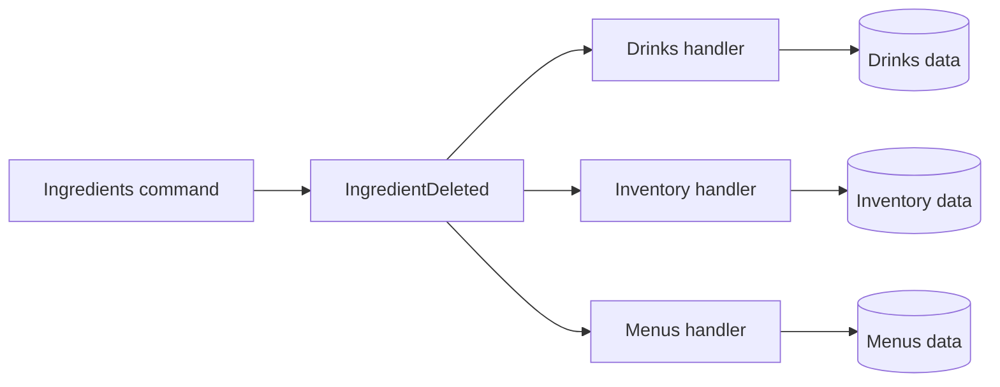
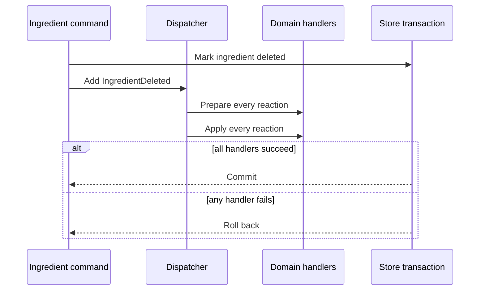

<!-- Generated from https://thefellow.github.io/guides/turning-cross-domain-calls-into-enforced-boundaries/ by scripts/generate_llm_content.py; do not edit. -->

# Turning Cross-Domain Calls into Enforced Boundaries

Source: [https://thefellow.github.io/guides/turning-cross-domain-calls-into-enforced-boundaries/](https://thefellow.github.io/guides/turning-cross-domain-calls-into-enforced-boundaries/)

## Pyramid summary

- **~2 words:** Domain boundaries
- **~8 words:** Transactional events replace cross-domain calls with enforced ownership.
- **Expanded:** A worked path from direct cross-domain orchestration to transactional events, owned handlers, and package rules that keep a Go modular monolith modular.

## Full content

A boundary becomes interesting when a change on one side has consequences on the other.

In [Mixology](https://github.com/TheFellow/go-modular-monolith), deleting an ingredient affects more than the Ingredients domain. Inventory may hold a quantity of it, Drinks may use it in recipes, and Menus may contain those drinks. The direct implementation is tempting: let the ingredient deletion code call each dependent domain in sequence.

```go
func (c *Commands) Delete(ctx *middleware.Context, ingredient *models.Ingredient) error {
    if err := c.ingredients.Delete(ctx, ingredient.ID); err != nil {
        return err
    }
    if err := c.inventory.Delete(ctx, ingredient.ID); err != nil {
        return err
    }
    drinks, err := c.drinks.DeleteUsingIngredient(ctx, ingredient.ID)
    if err != nil {
        return err
    }
    return c.menus.RemoveDrinks(ctx, drinks)
}
```

The code is easy to follow locally, but its ownership points in the wrong direction. Ingredients has to know which domains care about its lifecycle, how each one represents deletion, and in which order their operations are safe. The next dependent domain makes the command larger. A change in another module forces Ingredients to change even when ingredient behavior itself did not.

I use this dependency pressure to derive the boundary. The result is not events for their own sake. It is an arrangement where each domain owns its reaction, the original operation remains atomic, and the repository rejects shortcuts back to the coupled design.

This is the worked follow-up to the event-coordination lesson in [Building High-Quality Software](/guides/building-high-quality-software.md). That guide places transactional events inside Mixology's wider architecture; this one stays with the boundary and follows the dependency change through code, repository rules, and tests.

## Separate questions from decisions

The first useful split is between queries and commands. A query answers a question without changing application state. A command makes a domain decision and may record facts about what changed.

That does not require two databases, asynchronous projections, or a framework. In Mixology it appears directly in the package shape. Public query contracts are available to collaborators. Commands and persistence stay behind the domain's public module.

```text
app/domains/<domain>/
  module.go                 public application facade
  models/                   public domain values
  queries/                  public read contracts
  events/                   public facts
  handlers/                 this domain's reactions
  internal/
    commands/               private write decisions
    dao/                    private persistence
```

This distinction removes an ambiguous category of reusable write helpers. Another domain may ask Ingredients a supported question through a query. It may not reach into an ingredient command or DAO to make a partial ingredient change. Writes enter through the module, where authorization, transaction management, audit, and event dispatch apply consistently.

The package names are useful because they state what kind of dependency a caller is taking. More importantly, they give static analysis something precise to enforce.

## Announce the fact that belongs to the source domain

An ingredient command knows that an ingredient was deleted. It should not know every consequence of that fact.

The real [delete command](https://github.com/TheFellow/go-modular-monolith/blob/main/app/domains/ingredients/internal/commands/delete.go) updates the ingredient, records the touched entity for audit, and adds an `IngredientDeleted` event to the operation context. The event belongs to Ingredients and carries the deleted ingredient state plus its deletion time.

```go
ctx.AddEvent(events.IngredientDeleted{
    Ingredient: deleted,
    DeletedAt:  now,
})
```

That direction matters. Ingredients publishes a fact from its own vocabulary. It does not publish commands such as `RemoveInventory` or `DeleteRecipes`, because those names prescribe decisions owned by Inventory and Drinks.

The dependent domains own handlers for the fact:



[Inventory's handler](https://github.com/TheFellow/go-modular-monolith/blob/main/app/domains/inventory/handlers/ingredient-deleted.go) decides what the event means for inventory. [Drinks](https://github.com/TheFellow/go-modular-monolith/blob/main/app/domains/drinks/handlers/ingredient-deleted.go) finds recipes that use the ingredient and removes the affected drinks. [Menus](https://github.com/TheFellow/go-modular-monolith/blob/main/app/domains/menus/handlers/ingredient-deleted.go) removes those drinks from menus. Adding another reaction changes the dispatcher and the interested domain, not the Ingredients command.

The event reduces knowledge, but it does not remove coordination. Mixology's generated dispatcher still invokes the complete handler set. That wiring is intentionally visible and testable.

## Preserve the transaction while changing the dependency direction

Events do not imply asynchronous delivery. Mixology dispatches these events in process, inside the transaction opened for the originating command.

This choice gives the boundary a strong behavioral contract. If the Menu reaction fails, the ingredient deletion and the changes made by earlier handlers roll back together. Callers observe one successful application operation or no change. The domains are separated by ownership and dependency direction without giving up immediate consistency.

The dispatcher also has a preparation phase. A handler may need to discover affected state before another handler changes it. For ingredient deletion, Menus needs to know which drinks contain the ingredient before Drinks removes them. Every `Handling` method runs before any `Handle` method begins mutating data. Preparation gathers the information each reaction needs, then application starts.



Handlers receive a narrower [`HandlerContext`](https://github.com/TheFellow/go-modular-monolith/blob/main/pkg/middleware/context.go) that has transaction, principal, and audit capabilities but cannot add another event. A handler is a leaf reaction. This prevents one deletion from growing into an implicit, unbounded event chain whose transaction and ordering become difficult to reason about.

The constraint is a design choice, not an incidental limitation. If a reaction needs to start a new business operation, that workflow should become explicit at the application boundary instead of hiding inside recursive dispatch.

## Turn the package diagram into build rules

A package diagram documents intent. It does not stop a handler from importing another domain's command when that call appears convenient.

[arch-lint](/projects/arch-lint.md) lets Mixology express dependency direction as repository rules. Its glob captures relate the importing domain to the imported domain, so one rule applies to current and future modules. The important constraints for this design are:

- a domain cannot import another domain's `internal` packages;
- handlers cannot import command packages;
- event and model contracts cannot depend on private implementation;
- queries cannot import commands;
- handlers collaborate through public events, queries, and models rather than another domain's facade.

The current [`.arch-lint.yaml`](https://github.com/TheFellow/go-modular-monolith/blob/main/.arch-lint.yaml) records the exact rules. Captures make ownership relative instead of hard-coding Ingredients, Drinks, Inventory, and Menus into separate declarations. When a developer adds a domain, the existing rule already knows what crossing its private boundary means.

The rules deliberately leave collaboration paths open. A blanket ban on cross-domain imports would only push coupling into a generic package or duplicate useful contracts. Public models, queries, and events are the vocabulary through which domains may collaborate. The linter distinguishes those intentional paths from private commands and persistence.

Import checks cover edges in the dependency graph, but not missing nodes. Mixology complements them with topology and composition tests. The topology test rejects unrecognized peer layers, while the composition test ensures every domain directory is exposed and initialized by the application. Together they check which packages may exist, which direction imports may point, and whether each module actually joins the running system.

## Test the behavior at the public boundary

The architecture earns its complexity in one integration test. [`TestIngredients_Delete_CascadesToDrinksMenusAndInventory`](https://github.com/TheFellow/go-modular-monolith/blob/main/app/domains/ingredients/delete_test.go) creates an ingredient, inventory for it, a drink recipe that uses it, and a published menu containing that drink. It deletes the ingredient through the public module, then observes all three dependent domains through their public modules.

The test does not call handlers or inspect dispatcher registration. It proves the application behavior a caller depends on. Focused handler and dispatcher tests can locate failures, while this test protects the complete route:

```text
public module
  -> command pipeline
  -> ingredient command
  -> domain event
  -> generated dispatcher
  -> owned reactions
  -> one commit
```

An additional failure-path test can make the atomicity claim executable by forcing one reaction to fail and asserting that every domain retains its original state. The import linter proves that forbidden shortcuts do not compile in the repository. The application test proves that the allowed route still accomplishes the work.

## Let the boundary explain the system

The original direct-call version puts the complete workflow in one function, but it also puts knowledge of several domains under one owner. The event-driven version distributes the implementation while making its contracts more explicit: Ingredients owns the fact, each dependent domain owns its response, the dispatcher owns delivery, and the middleware owns the transaction.

That distribution works because the constraints travel with it. Package visibility hides private writes. A narrower handler context removes recursive publication. arch-lint rejects forbidden imports. Integration tests prove the cross-domain outcome and rollback boundary.

The useful progression is therefore:

1. Notice a write path accumulating knowledge of other domains.
2. Separate public questions from private decisions.
3. Publish a fact in the source domain's vocabulary.
4. Move each consequence to the domain that owns it.
5. Keep delivery inside the transaction when the behavior requires atomicity.
6. Encode the permitted dependency graph in the build.
7. Test the complete operation through public boundaries.

That is how a modular monolith stays modular under ordinary feature work. The event changes the dependency direction, and the executable constraints keep it changed.
