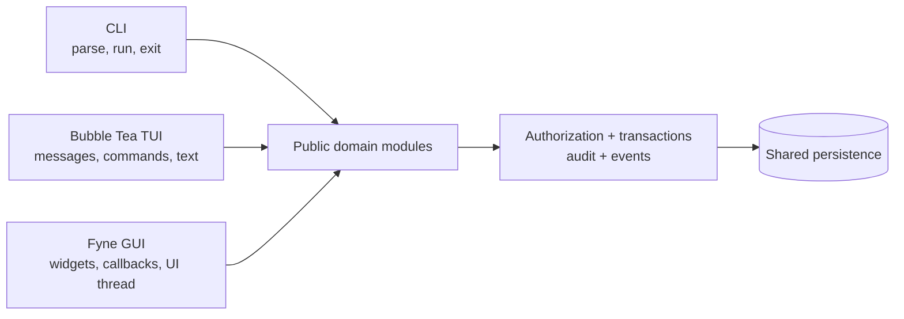
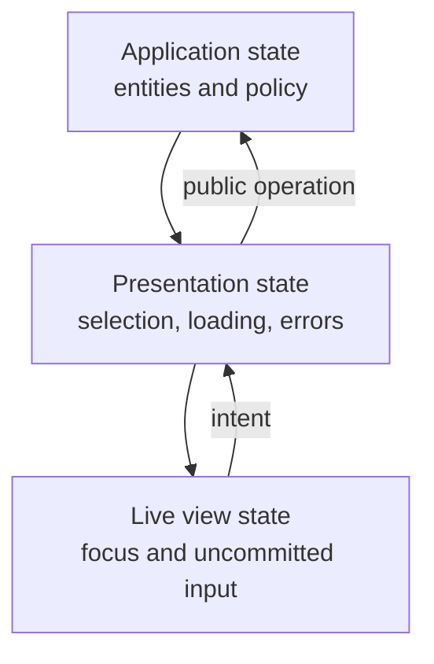
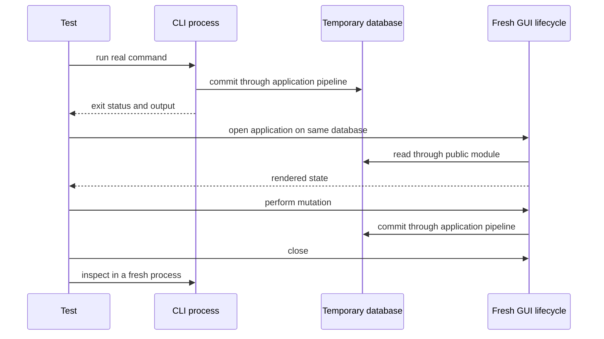

<!-- Generated from https://thefellow.github.io/guides/using-a-third-surface-as-an-architecture-test/ by scripts/generate_llm_content.py; do not edit. -->

# Using a Third Surface as an Architecture Test

Source: [https://thefellow.github.io/guides/using-a-third-surface-as-an-architecture-test/](https://thefellow.github.io/guides/using-a-third-surface-as-an-architecture-test/)

## Pyramid summary

- **~2 words:** Architecture audit
- **~8 words:** A third presentation runtime tests whether application boundaries are real.
- **Expanded:** What Mixology's Fyne client revealed when a third, substantially different presentation runtime had to use the same application boundaries as its CLI and TUI.

## Full content

An architecture diagram can show three adapters pointing at one application boundary. A third adapter makes that claim executable.

Mixology began with a command-line interface and a persistent Bubble Tea terminal interface. Adding a native [Fyne](https://fyne.io/) desktop client introduced a presentation runtime with different pressures: retained widgets instead of rendered text, callbacks instead of typed messages, a UI goroutine, dialogs, focus, background work, and long-lived forms. The new client could not succeed by imitating either existing surface. It had to express the same application behavior in its own native vocabulary.

That made the third surface an architecture test. It found shared behavior that was genuinely reusable, assumptions that belonged to one runtime, operations that were missing from another adapter, and application contracts that looked sufficient until a new interaction model exercised them.

This is a stronger test than adding another screen to an existing client. A second screen usually follows the first screen's conventions. A substantially different surface challenges where those conventions live.

## What the test is actually testing

The useful invariant is not that every surface has the same classes, view models, or navigation. It is that every operation crosses the same public application boundary and receives the same domain behavior.



In Mixology, each adapter enters exported domain modules through an application session. The pipeline owns authorization, transaction boundaries, auditing, and event publication. A surface owns presentation state and translates user intent into those public operations. It does not import a DAO, call a private command, or use another surface as a library.

This gives the architecture test four concrete questions:

1. Can the new runtime implement its natural interaction model using only public application capabilities?
2. Does the same operation retain its authorization, transaction, audit, and event behavior through every adapter?
3. Can each surface remain specific to its runtime without moving presentation mechanics into the domain?
4. Can a write through one real adapter be observed through another after a fresh application lifecycle?

An import graph answers part of the first three questions. Cross-surface tests answer the fourth.

## Difference creates the pressure

The CLI is short-lived. It parses arguments, performs an operation, renders a result, and exits. The TUI is a persistent message loop. It owns a current route, cached view models, keyboard input, commands, and text rendering. The GUI is also persistent, but its widgets retain state independently of the presentation snapshot and its background results must return through the UI goroutine.

Those differences are valuable. If the desktop client had merely wrapped the CLI, it would have tested argument reuse rather than the application boundary. If it had reused Bubble Tea view models, it would have pulled terminal messages, key bindings, and rendering policy into a runtime that has native controls and callbacks.

Mixology instead added a sibling adapter below each domain:

```text
app/domains/drinks/surfaces/
    cli/
    gui/
    tui/
```

The three directories share public domain models and operations, not presentation implementations. Drinks can expose recipes in each runtime's vocabulary. The CLI accepts structured arguments, the TUI coordinates a message-driven editor, and the GUI presents named selectors and retained form controls. The application operation beneath them remains the same.

This is the first architectural result: reuse belongs at the narrowest stable boundary. Transport-neutral identifiers, filters, models, typed errors, and application operations remain shared. Widget trees, terminal models, argument parsing, focus, selection, and navigation remain surface-owned.

## Parity is a union, not a porting checklist

The first desktop parity matrix treated the CLI and TUI as a reference set. Detailed comparison showed that the reference set had drifted. Some workflows existed only in the CLI. Some persistent interactions were richer in the TUI. Some application operations had no complete presentation anywhere.

The correct parity target was therefore the union of observable behavior across the existing adapters:

$$
P_{target} = P_{CLI} \cup P_{TUI}
$$

The GUI then had to account for each capability, but it did not have to reproduce the same sequence of gestures. Menu drink curation could be arguments in one surface, a mode in another, and a detail action in the third. Parity concerned the application outcome and its policy, not identical interaction choreography.

This comparison found concrete gaps:

- Selectors that need a complete catalog exposed first-page-only queries.
- Ingredient deletion required dependency checks across every page, not only visible rows.
- Menu curation and order placement existed outside the initial TUI workspace inventory.
- Audit queries had defaults whose semantics could be accidentally changed by a desktop convenience layer.
- Authorization had to shape navigation, dashboards, actions, and error handling, not only reject a final write.

None of these findings required a universal presentation abstraction. They required precise public operations and a complete behavioral inventory.

## The new runtime exposes hidden ownership

A retained desktop form made state ownership especially visible. The person can type into a widget after the presenter published its last snapshot. A catalog refresh may complete while that edit is in progress. Repainting the widget from the older snapshot would erase newer input.

That creates three distinct kinds of state:



The application owns persisted truth and policy. The presenter owns durable interaction meaning, including selection, workflow mode, validation, request generations, and mutation ownership. The live view owns framework controls, focus, and input newer than the last snapshot.

The third surface forced Mixology to state that model explicitly. It also exposed several timing rules:

- A late load result may publish only if it still owns the latest request generation.
- Reopening a form creates a new form instance even when its initial values equal the previous instance.
- A confirmation captures its mutation target before asynchronous dependency checks begin.
- A denied mutation retains correctable form input while presenting the typed authorization error.
- Shutdown stops accepting work and drains operations already accepted by the desktop lifecycle.

These rules are specific responses to retained-mode and asynchronous interaction, but the underlying ownership questions apply to every persistent client. The GUI made them harder to ignore.

## Cross-surface evidence must cross boundaries

A test that calls a public module and then reads the result through a presenter proves that both use the application contract. It does not prove that a real CLI parses its command, opens the intended database, commits, and exits successfully.

Mixology's stronger tests build the CLI executable, invoke it as a subprocess against a temporary database, then open a fresh desktop lifecycle over that database and drive concrete GUI views. The reverse direction writes through the GUI, closes the desktop, and inspects the result through a fresh CLI invocation.



That sequence tests composition roots, configuration, persistence ownership, adapter translation, and lifecycle behavior together. It also avoids a misleading shortcut: one presentation package never imports another. The test coordinates independent clients from outside both of them.

The evidence can be arranged as a ladder:

- Package rules prove which dependencies are allowed to compile.
- Surface tests prove that each adapter translates intent and results correctly.
- Application tests prove policy, transactions, audit, and events.
- Cross-surface process tests prove that independently composed clients share the same durable contract.

No one rung replaces the others.

## Architectural findings should change the first two surfaces

A third surface is not an audit if every discrepancy is worked around locally. Findings should flow back to their owner.

When complete selectors required traversal, the fix belonged in the GUI presenter if the public API was intentionally paged. When the TUI lacked an existing public workflow, the correction belonged in the TUI. When multiple adapters needed a clearer operation or typed result, the application boundary was the place to improve. When retained widgets needed generation tracking, that remained GUI presentation mechanics.

I use a simple placement test:

| Finding | Owner |
| --- | --- |
| Domain invariant or transaction semantics | Application/domain module |
| Missing public capability | Public application boundary |
| Argument parsing or process output | CLI surface |
| Message, key, or terminal layout behavior | TUI surface/toolkit |
| Widget, focus, dispatch, or retained-state behavior | GUI surface/toolkit |
| Repeated product-wide presentation policy | Application presentation layer |

The table keeps a parity project from becoming an excuse to centralize everything. A behavior can be important in all clients while still requiring three implementations.

## A repeatable third-surface audit

The approach is useful before, during, and after implementation.

Start by inventorying observable workflows from every existing adapter. Include loading, empty and error states, filters, selection, validation, create and edit flows, destructive confirmation, domain-specific actions, authorization, refresh behavior, and lifecycle. Treat the inventory as a union rather than declaring one existing client canonical.

Next, write the dependency rule: the new surface may call public modules and use shared transport-neutral types, but it may not import domain internals or another surface. Add package-level architecture checks before convenience pressures accumulate.

Then implement complete vertical slices. A slice should include the application call, presentation state, native view, error behavior, authorization behavior, and tests. A screenshot of a list is not evidence for create, edit, paging, stale results, or denied actions.

Finally, cross the process and lifecycle boundary. Write through one executable, close it, and observe through another freshly composed client. Repeat in the reverse direction for at least one mutation. This is where configuration drift, persistence assumptions, and adapter-only shortcuts become observable.

## The result

Mixology's third surface did more than add a desktop window. It tested whether the modular monolith had one application with three adapters or three applications sharing a database.

The strongest evidence came from difference. Fyne's retained widgets and UI-thread contract forced explicit asynchronous ownership. The parity union exposed missing and partial workflows. Fresh-process tests exercised the real composition roots. Package rules preserved sibling adapters instead of allowing one presentation technology to become the accidental core.

A third surface is therefore most useful when it remains genuinely third: native to its runtime, restricted to the public application boundary, and verified against the other clients through observable behavior. Under those conditions, presentation work becomes an executable architecture review.
