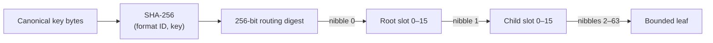
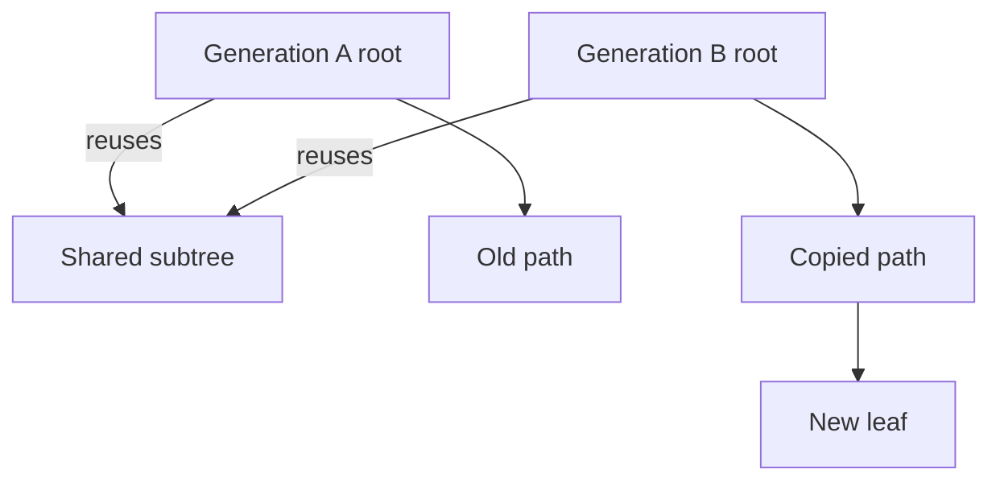

<!-- Generated from https://thefellow.github.io/notes/building-a-persistent-merkle-trie-in-go/ by scripts/generate_llm_content.py; do not edit. -->

# Building a Persistent Merkle Trie in Go

Source: [https://thefellow.github.io/notes/building-a-persistent-merkle-trie-in-go/](https://thefellow.github.io/notes/building-a-persistent-merkle-trie-in-go/)

## Pyramid summary

- **~2 words:** Merkle trie internals
- **~8 words:** Canonical codecs and lazy snapshots build a persistent content-addressed trie.
- **Expanded:** How canonical codecs, radix routing, structural sharing, and lazy snapshots fit together in a generic content-addressed trie.

## Full content

A map answers a local question: which value belongs to this key? A Merkle trie can answer that question while also producing a compact identity for a complete generation of the map. If any encoded key, value, or reachable node changes, its root changes. That makes the structure useful when versions need to be persisted, compared, or exchanged without rewriting one large document.

I built [go-merkletrie](https://github.com/TheFellow/go-merkletrie) to explore that combination as a small generic Go package. It has an immutable in-memory tree, a canonical object format, eager validation, and lazy snapshots over caller-owned storage. The quick start looks like an ordinary typed map with explicit versions:

```go
codec, err := merkletrie.NewCodec(
	merkletrie.StringEncoding(),
	merkletrie.Uint64Encoding(),
)
if err != nil {
	log.Fatal(err)
}

empty, err := merkletrie.New(codec)
if err != nil {
	log.Fatal(err)
}

one, changed, err := empty.Put("answer", 42)
if err != nil {
	log.Fatal(err)
}

value, found, err := one.Lookup("answer")
```

`empty` still has no entries. `one` contains the inserted value, and `changed` says whether the operation produced a different generation. An identical `Put` and a `Delete` for a missing key preserve the root and report `false`.

## Make bytes part of the type contract

A content hash is only stable when the bytes beneath it are stable. The trie therefore does not accept arbitrary serialization as a hidden implementation detail. A `Codec[K, V]` owns canonical encodings for both sides of an entry:

```go
type Codec[K, V any] interface {
	CompatibilityID() Digest
	EncodeKey(K) ([]byte, error)
	DecodeKey([]byte) (K, error)
	EncodeValue(V) ([]byte, error)
	DecodeValue([]byte) (V, error)
}
```

Encoders must be deterministic, distinct logical keys must produce distinct key bytes, and decoding then re-encoding must recover the same bytes. The package checks that round trip when it decodes persisted leaves. Built-in encodings cover strings, byte slices, and fixed-width signed and unsigned integers. `NewEncoding` supplies the same contract for an application type, and `NewCodec` combines independent key and value encodings.

The compatibility ID identifies the meaning of those bytes, not just their Go types. If a record gains a field, an enum changes meaning, or a serialization rule changes, its ID changes as well. The trie combines that ID with its routing parameters, hard limits, protocol version, and an optional namespace to derive a format ID. Every stored object and even the empty root is bound to that format.

This prevents a subtle class of persistence error. Two stores may both contain `string` keys and JSON values while assigning different semantics to the JSON. Their explicit schema identities keep one root from being opened as the other.

## Route by digest, four bits at a time

The trie hashes each canonical key together with the format ID. Each nibble of that SHA-256 digest selects one of 16 child slots, so an internal node is a 16-way radix branch. Leaves keep canonical key/value pairs sorted by digest and encoded key. Once a leaf would exceed either its entry-count or encoded-size bound, the builder groups its entries by the next nibble and recursively creates the required children.



Using the digest keeps routing independent of the key type and gives every path a fixed maximum of 64 four-bit steps. A leaf still stores and compares the canonical key bytes. If two distinct keys ever have the same complete routing digest, the operation returns `ErrCollision` instead of treating them as one entry.

The hard bounds are part of the format: keys are at most 4 KiB, values at most 240 KiB, leaves at most 128 entries and 256 KiB, and a path cannot exceed the digest's 64 four-bit steps. These limits keep individual objects decodable with predictable memory use.

## Copy the changed path

Immutability comes from path copying. A `Put` walks to one leaf, rebuilds that leaf, then rebuilds each ancestor on the path to the root. Every untouched child remains shared with the previous tree. `Delete` follows the same pattern and removes empty branches as it returns.



No published object is edited in place. That is why old `Tree` values remain safe to read and why persisting another generation only requires newly reachable objects. It also makes a root a natural generation handle.

Deletion deliberately does not merge a remaining subtree back into a shallower leaf. Merging would make every delete inspect and potentially rewrite more of the graph. The tradeoff is that physical shape records some history. Two trees can contain identical entries but have different root object IDs because one previously grew enough to split.

To make that distinction visible, every reference also carries a `SemanticRoot`: an entry count and a shape-independent fingerprint formed by adding entry hashes modulo 2²⁵⁶. Matching physical IDs prove identical encoded shape and content. Matching semantic roots are a quick content-equality hint, but not cryptographic proof, because additive summaries can collide. Code that requires proof can compare the entries.

## Turn nodes into immutable objects

Leaves and internal nodes have canonical binary encodings. Every object begins with an eight-byte header containing the `GMTR` signature, format version, object kind, and reserved bytes. The format ID follows, along with depth and semantic summary data. A leaf then carries its sorted encoded entries. A node carries each occupied slot and its child's complete reference.

The object's SHA-256 digest becomes its content ID. Parents include child IDs, so a change propagates upward until the root identifies the complete reachable graph. `Tree.Objects` walks that graph once and emits children before parents:

```go
for _, object := range tree.Objects() {
	store.Put(object.ID, object.Payload)
}
publishAtomically(tree.Root())
```

The order defines the commit protocol. First make every object durable under its content ID, then atomically publish the small root reference. An interrupted object write leaves the old root valid. An interrupted root publication can be retried after all of its dependencies exist. Since objects are immutable, writing the same content ID again is idempotent.

`Load` reconstructs a complete in-memory tree by resolving every reachable object. It checks the requested content ID, object format, canonical re-encoding, stored summaries, depth, child references, and whether every leaf entry actually belongs beneath its path. Successful eager loading therefore validates the entire generation before returning it.

## Keep persisted trees lazy

Loading the complete graph is unnecessary when an operation touches one key. `Open` instead returns a `Snapshot[K, V]` backed by a small resolver interface:

```go
type Resolver interface {
	Resolve(context.Context, Reference) ([]byte, error)
}

snapshot, err := merkletrie.Open(codec, publishedRoot, store)
value, found, err := snapshot.Lookup(ctx, "answer")
```

Opening validates the root's shape and format without resolving an object. A lookup fetches and validates only the nodes along its digest path. A mutation does the same, then puts newly encoded objects in a shared in-memory overlay and returns another immutable snapshot.

After several mutations, `FinalChange` traces the final root through that overlay and returns only newly reachable objects. Superseded objects created by intermediate mutations are excluded. The resulting publication sequence is the same as the in-memory tree:

```go
snapshot, _, err = snapshot.Put(ctx, "answer", 43)
snapshot, _, err = snapshot.Put(ctx, "new", 1)

change := snapshot.FinalChange()
for _, object := range change.Objects {
	store.Put(object.ID, object.Payload)
}
publishAtomically(change.Root)
```

The resolver remains application-owned. It can use a directory, database, object service, cache, or a combination of them. Context cancellation passes through each read, while the package consistently validates what comes back before using it as a trie node.

## Keep trust at the decoding boundary

Content addressing detects changed bytes, but it does not by itself establish that bytes form a valid trie. A digest can correctly identify a malformed object. The decoder therefore treats stored payloads as untrusted structure and recomputes the invariants that matter.

Per-object limits bound one decode. Applications resolving roots from an untrusted source should additionally bound total reads, total bytes, and elapsed time across the graph. That surrounding policy belongs in the resolver because storage latency, caching, and acceptable generation size depend on the application.

The result is a deliberately small boundary. The trie owns deterministic encoding, routing, structural sharing, object validation, and change calculation. The application owns the meaning of its types, durable object storage, and atomic publication of generation roots.

## Follow the executable path

The repository includes four examples that build on one another:

- `examples/basic` keeps historical in-memory versions alive.
- `examples/custom-codec` defines a canonical application encoding and namespace.
- `examples/lazy-storage` persists a generation, opens it lazily, stages changes, and publishes the resulting objects before its root.
- `examples/content-addressed-files` uses the trie as a versioned index from logical paths to blob metadata. Identical file contents share one SHA-256-addressed blob, file bytes stay outside the trie's bounded values, and both the old and updated generations reopen lazily from disk.

That progression captures the main idea behind the package. An immutable map becomes a persistent Merkle trie when canonical application bytes determine radix paths, copied paths become content-addressed objects, and one validated root names the resulting generation.
